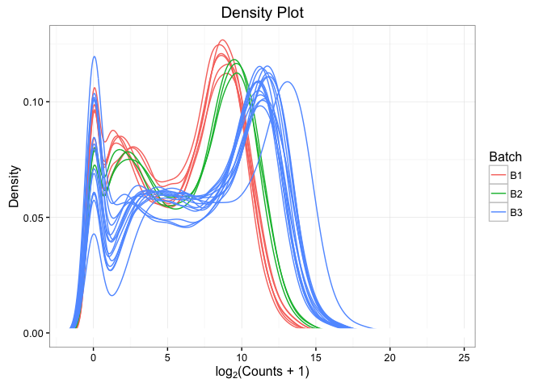
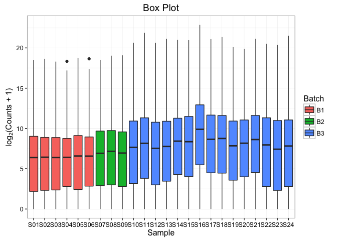
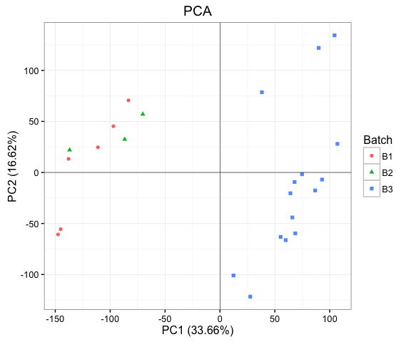

Adalimumab Data: 
================
Preliminary Review and Concerns
-------------------------------

-   [Preprocessing](#preprocessing)
-   [Diagnostic Plots](#diagnostic-plots)
-   [Other Issues](#other-issues)

All analysis was conducted in R version 3.3.1 using the following script. Computations were performed on a MacBook Pro with 16GB of RAM.

``` r
# Load libraries
library(data.table)
library(tximport)
library(DESeq2)
library(ggplot2)
library(wordspace)
library(RColorBrewer)
library(NMF)
library(tidyr)
library(dplyr)
```

Preprocessing
=============

Raw RNA-sequencing data from all samples were aggregated, filtered, and normalised prior to analysis.

Aggregation
-----------

Reads were pseudo-aligned using [kallisto](http://www.nature.com/nbt/journal/v34/n5/full/nbt.3519.html). Our reference genome was GRCh38, [Ensembl](http://www.ensembl.org/index.html) version 79. Isoform abundances were collapsed to gene level for increased performance and reproducibility ([Soneson et al., 2016](http://f1000research.com/articles/4-1521/v2)).

``` r
# Read in clinical data
pheno <- read.csv('Adalimumab_LS_clin.csv', stringsAsFactors=FALSE)

# Create gene-level count matrix
t2g <- fread('Ensembl.Hs79.Tx.csv')
dir <- paste0(getwd(), '/Adalimumab/LS')
files <- file.path(dir, pheno$Count_file, 'MB.abundance.tsv')
txi <- tximport(files, type='kallisto', tx2gene=t2g, reader=fread)
```

Non-specific Filtering
----------------------

We removed underexpressed genes to cut down on noise and increase computational efficiency ([Bourgon et al., 2010](http://www.pnas.org/content/107/21/9546.long)). Similar non-specific filters are automatically applied in popular differential expression analysis software such as [DESeq2](https://www.bioconductor.org/packages/devel/bioc/vignettes/DESeq2/inst/doc/DESeq2.pdf).

``` r
# Remove underexpressed genes
mat <- txi$counts
mat <- mat[rowMeans(mat) > 1, ]
```

This removed about a third of all genes, leaving just under 26,000 for downstream analysis. All diagnostic plots were recreated on the complete dataset (not shown) with nearly identical results.

Normalisation
-------------

Count matrices were log-transformed for density plots and box plots. For PCA and subject similarity heatmaps, we used the regularised logarithm transform of [Love et al. (2014)](http://www.ncbi.nlm.nih.gov/pubmed/25516281).

``` r
# Log transform
lmat <- log2(mat + 1)

# Rlog transform
rld <- rlog(round(mat))

# Rownames
colnames(lmat) <- colnames(rld) <- c(paste0('S0', 1:9), paste0('S', 10:24))
```

Diagnostic Plots
================

Following preprocessing, we performed a variety of exploratory data anlyses to search for outliers, check for batch effects, and ensure data quality.

Density Plot
------------

We begin with a simple density plot, coloured by batch.

``` r
# Shape data
X <- Y <- matrix(0, 512, ncol(lmat))
  for (j in 1:ncol(lmat)) {
    d <- density(lmat[, j], na.rm=TRUE)
    X[, j] <- d$x
    Y[, j] <- d$y
  }

dat <- data.frame(Batch = rep(pheno$batch, each=512), gather(data.frame(X), Sample, lCounts),
                  Density = gather(data.frame(Y), Sample, Density) %>% select(Density))

# Plot results
ggplot(dat, aes(lCounts, Density, colour=Batch)) + geom_line(size=0.5) + 
  theme(legend.justification=c(1, 1), legend.position=c(1, 1)) + theme_bw() +
  labs(title='Density Plot', x=expression('log'[2]*'(Counts + 1)'))
```

<p align='center'>

</p>

It appears from this figure that there is considerable intra- and inter-batch variation in these data.

Box Plot
--------

Batch effects can also be detected from a box plot of the log-normalised counts.

``` r
# Shape data
dat <- data.frame(Batch = rep(pheno$batch, each=nrow(lmat)),
                  gather(data.frame(lmat), Sample, lCounts))

# Plot results
ggplot(dat, aes(Sample, lCounts, fill=Batch)) + geom_boxplot() + 
  labs(title='Box Plot', y=expression('log'[2]*'(Counts + 1)')) + theme_bw()
```

<p align='center'>

</p>

Principal Component Analysis
----------------------------

Clustering by batch is evident in the principal component subspace, the first two dimensions of which capture over 50% of variance in the data.

``` r
# Shape data
pca <- prcomp(t(rld), center=TRUE, scale.=TRUE)
dat <- data.frame(pca$x[, 1:2], Batch = pheno$batch)
imp1 <- round(summary(pca)$importance['Proportion of Variance', 1] * 100, 2)
imp2 <- round(summary(pca)$importance['Proportion of Variance', 2] * 100, 2)

# Plot results
ggplot(dat, aes(PC1, PC2, colour=Batch, shape=Batch)) + geom_point() + 
  geom_hline(yintercept=0, size=.2) + geom_vline(xintercept=0, size=.2) + 
  labs(title='PCA', x=paste0('PC1 (', imp1, '%)'), y=paste0('PC2 (', imp2, '%)')) + theme_bw()
```

<p align='center'>

</p>

Sample Similarity Heatmap
-------------------------

Batch 3 forms its own clade of the hierarchical clustering dendrogram atop our sample similarity heatmap.

``` r
# Shape data
dm <- dist.matrix(scale(t(rld)), method='euclidean')

# Choose colour palette
rb <- colorRampPalette(brewer.pal(10, 'RdBu'))(n=256)

# Plot results
aheatmap(dm, col=rb, Rowv=FALSE, annCol=list(Batch = pheno$batch), 
  distfun=function(x) as.dist(x), hclustfun='average', main='Sample Similarity Heatmap')
```

<p align='center'>

</p>

Strong batch effects do not necessarily doom a study's results. Batch is often included as a covariate in regression models ([Akey et al., 2007](http://www.nature.com/ng/journal/v39/n7/full/ng0707-807.html)), or else explicitly adjusted for using the popular ComBat method of [Johnson & Li (2006)](http://biostatistics.oxfordjournals.org/content/8/1/118.abstract). Unfortunately, neither alternative is available to us in this case, as batch is 100% confounded with the other variables in our intended design matrix. To be effectively removed, batches must be (approximately) balanced across subjects and time points. Nesting clinical covariates within a batch makes it mathematically impossible to distinguish between biological signal and technical artefact.

Other Issues
============

Other issues worth flagging in this dataset include the absence of week 12 PASI observations, without which it is impossible to measure patient response; and the heavy imbalance between samples of lesional and nonlesional skin, which should ideally be taken from the same subject at the same time to facilitate a paired study design. We're hopeful these issues will be addressed in future PSORT datasets.
