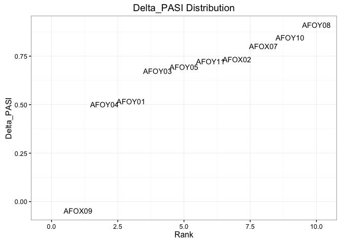

Transcriptomic Signatures of Treatment Response in Psoriasis
================
David Watson, Amy Foulkes & Mike Barnes

-   [Project Summary](#project-summary)
-   [Data Preparation](#data-preparation)
-   [Baseline Comparison](#baseline-comparison)

Project Summary
===============

Premise
-------

Between 2011 and 2012, participants were recuited in the North West of England to a study entitled "Pharmacogenomic signatures of treatment response in psoriasis" (Research Ethics UK 11/NW/0100) seeking to evaluate gene expression profile from patients with moderate to severe psoriasis.

The overall aim of this pilot project was to evaluate the feasibility of personalised treatments. Biologic therapies (now comprising 5 licensed effective injectable treatments) are expensive (approx £10,000 per patient per year) and have been associated with potentially serious adverse events.

The use of biologic therapies continues to increase. Psoriasis itself is an excellent candidate disease for personalisation of therapies; it is common, chronic and life-limiting with adverse effects on quality of life indices and high impact on healthcare systems. Inflammatory skin disease is an excellent choice for study, with ready access to disease tissue and objective validated scores of disease severity.

Clinical project overview
-------------------------

We prospectively recruited 10 participants, washed out from prior therapies, genetically homogenous (Caucasian with European ancestry to third generation) and collected detailed phenotype information. All patients had disease confirmed by a Consultant Dermatologist and had chronic plaque disease (the most common form, other forms of disease were excluded) with onset at or prior to the age of 40 (Type I or 'early onset' disease). These patients recevied treatment with the tumour necrosis factor inhibitor [Etanercept](https://www.nice.org.uk/guidance/ta199).

Extensive samples were taken, including blood, skin and urine at the 3 clinical time points - baseline (immediately prior to first injection, after washout of 2 weeks from prior therapy or at least 4 x 1/2 life of prior drug); 1 week after treatment; and 12 weeks after treatment. Skin samples were taken from controlled, photoprotected sites on the lower back or upper buttock, from both normal looking skin and from the edge of a plaque of psoriasis. Repeat biopsies were taken at a minimum distance of 2cm from prior biopsies. The severity score Psoriasis Area and Severity Index (PASI) was measured at each visit. All visits were conducted by one doctor and one specialist nurse. Participant journey through treatment was monitored, including adherence to therapy.

Analytic Goals
--------------

**Our aim is to evaluate gene expression profile at baseline, or early in therapy (week 1 data) and ask whether this can predict treatment response at week 12.**

This is fundamental for proof of principle, with a larger Consortium collaborative project Psoriasis Stratification to Optimise Relevant Therapies [PSORT](http://www.PSORT.org.uk) currently recruiting a larger cohort of patients commencing biologic therapy. Furthermore, we have further DNA SNP array, metabolomic and proteomic data for multi-omic data integration following completion of analysis of the RNA-seq data.

The following represents a first draft of our DESeq analysis pipeline for these data. While we ultimately intend to analyse each tissue type both within and across time points, this script is limited to a baseline comparison of gene expression profiles from lesional skin samples as an example to demonstrate our basic approach and raise certain issues we've encountered thus far.

``` r
# Load libraries
library(readr)
library(dplyr)
library(tximport)
library(sva)
library(DESeq2)
```

Data Preparation
================

Loading
-------

Following RNA-seqencing of all samples, reads were pseudo-aligned using [kallisto](http://www.nature.com/nbt/journal/v34/n5/full/nbt.3519.html). The following code chunk presumes that your working directory contains:

-   the clinical factors file ('Clinical\_factors\_Pre\_PSORT\_Amy\_v6\_26\_7\_16.csv');
-   the isoform mapping file ('Transcripts.tsv'); and
-   a subdirectory with folders corresponding to the kallisto output for each sample ('LesionalSkin').

``` r
pheno <- read_csv('Clinical_factors_Pre_PSORT_Amy_v6_26_7_16.csv')
t2g <- read_tsv('Transcripts.tsv')
dir <- paste(getwd(), 'LesionalSkin', sep='/')
files <- file.path(dir, pheno$sample, 'abundance.tsv')
txi <- tximport(files, type='kallisto', tx2gene=t2g, reader=read_csv)
```

As we discussed at CSAMA, we have several key questions related to this script. We are primarily concerned with the proper categorisation of response, and finding an appropriate design for answering our clinical question using time course data.

Response
--------

Clinically and for the purposes of funding, we measure psoriasis severity using the Psoriasis Area and Severity Index ([PASI](https://www.ncbi.nlm.nih.gov/pubmed/?term=psoriasis+area+severity+index+PASI+Fredriksson)). This provides a score between 0 and 72, where a score of &gt; 10 signifies severe disease. Whilst this score has numerous problems including high inter-individual variability in measurement and poor sensitivity at the lower end of the scale, it is the most widely used measure in psoriasis research and is adopted through clinical guidelines UK & Europe wide for the eligibility for biologic therapies and the assessment of response. It is non-linear. Most commonly, a 75% improvement from baseline score signifies response to treatment, a &lt; 50% improvement signifies non-response, and anything in between is considered an intermediate response. Newer successful therapies are expected to reach PASI 90 as a benchmark for later phases of clinical trials.

During our study, I also recorded additional response measurements including the Physician Global Assessment ([PGA](https://www.ncbi.nlm.nih.gov/pubmed/?term=psoriasis+global+assessment+langley+2004)) and the Dermatology Quality of Life Index ([DLQI](http://www.ncbi.nlm.nih.gov/pubmed/8033378)). The PGA is rarely used in clinical practice but is commonly used in clinical trials. The DLQI is used routinely in clinical practice, but is not specific to psoriasis. It has many flaws, not least that it leads to many NAs, for instance when subjects are embarrassed to answer questions relating to relationships, exercise etc. It is used by funders in the UK as a surrogate marker of response; patients with a less than adequate response (by PASI) to a biologic but with a 5 point improvement in the DLQI can continue their treatment.

### Delta\_PASI Distribution

The distribution of our cohort's percent change in PASI scores between baseline and week 12 (a variable labeled 'Delta\_PASI' in our clinical factors file) suggests that a binary response measure would be completely arbitrary.

``` r
plot(Delta_PASI ~ rank(Delta_PASI), data=pheno, main='Delta_PASI Distribution')
```

<p align='center'>

</p>

This plot, in conjunction with the fact that a single clinician recorded every PASI score in our dataset, led us to conclude that we should analyse response on a continuous scale.

Based on our discussions at CSAMA, we considered transforming our response data to give it a more symmetrical distribution. However, one patient's disease worsened during treatment, resulting in a negative Delta\_PASI score. We considered adding a small value (e.g. ~ .05) to each patient's Delta\_PASI score in order to facilitate a log or Box-Cox transformation, but were unsure if this would be appropriate. For now, we have decided to measure response via simple percentage change.

### Time Course Analysis

Clinically using a baseline within-patient measurement with repeated during-treatment observations makes sense. We understand for our analysis we need to interact time and response. The interaction of a factor *x* and a continuous variable *y* requires the creation of *k* new variables, one for each level of *x*.

``` r
pheno <- pheno %>%
  mutate(wk0.Delta_PASI  = ifelse(time == 'wk0',  Delta_PASI, 0),
         wk1.Delta_PASI  = ifelse(time == 'wk1',  Delta_PASI, 0),
         wk12.Delta_PASI = ifelse(time == 'wk12', Delta_PASI, 0))
```

This solution produces some sensible results (see below), but strikes us as somewhat sloppy and ad hoc. We are currently unaware of any better workaround than this, however we remain very open to any and all suggestions.

### Surrogate Variable Analysis (SVA)

We incorporate surrogate variables to account for unknown batch variation. Because our study involves repeat observations, we include 'subject' as a covariate in our null and full design matrices.

``` r
# Normalise and filter data before running SVA
dds <- DESeqDataSetFromTximport(txi, colData=pheno, design= ~ subject + wk0.Delta_PASI)
dds <- estimateSizeFactors(dds)
dat <- counts(dds, normalized=TRUE)
dat <- dat[rowMeans(dat) > 1, ]

# Run SVA
mod <- model.matrix(~ subject + wk0.Delta_PASI, data=pheno)
mod0 <- model.matrix(~ subject, data=pheno)
svobj <- svaseq(dat, mod, mod0)
```

    ## Number of significant surrogate variables is:  5 
    ## Iteration (out of 5 ):1  2  3  4  5

``` r
# Add surrogate variables to pheno
pheno <- cbind(pheno, svobj$sv)
colnames(pheno)[51:55] <- paste0('SV', 1:5)
```

Baseline Comparison
===================

Our data is now ready to be run through the DESeq2 pipeline.

``` r
dds <- DESeqDataSetFromTximport(txi, colData=pheno, 
                                design= ~ subject + SV1 + SV2 + SV3 + SV4 + SV5 + wk0.Delta_PASI)
dds <- DESeq(dds)
res <- data.frame(results(dds))
res <- res[order(res$pvalue), ]
```

Let's take a look at the genes declared significantly differentially expressed at 5% FDR.

``` r
na.omit(res[res$padj < .05, ])
```

    ##                baseMean log2FoldChange      lfcSE      stat       pvalue       padj
    ## IL19          208.31438      0.4149432 0.08545319  4.855795 1.199044e-06 0.01946012
    ## CCL13         680.30633     -0.5367886 0.11168661 -4.806204 1.538228e-06 0.01946012
    ## DAPL1        1399.86716     -0.4551021 0.10001398 -4.550385 5.354796e-06 0.04516235
    ## RP11-90P5.2    45.83283     -0.4833996 0.11016934 -4.387787 1.145098e-05 0.04934219
    ## IGLC1         233.76316      0.3606724 0.08252708  4.370352 1.240462e-05 0.04934219
    ## RP11-96D1.11  431.71814     -0.4238103 0.09773492 -4.336324 1.448851e-05 0.04934219
    ## CFAP157        45.00021      0.4877030 0.11286840  4.320988 1.553324e-05 0.04934219
    ## KRT84          14.78854      0.3253078 0.07530228  4.320027 1.560104e-05 0.04934219
