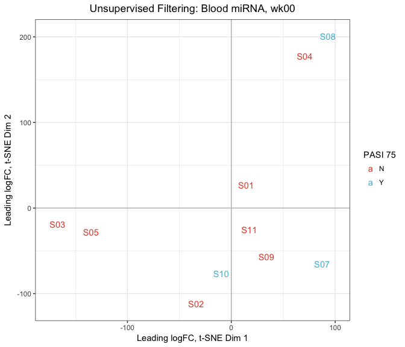

Clusters
================

-   [Overview](#overview)
-   [Load, Prepare Data](#load-prepare-data)
-   [Filtering](#filtering)
-   [t-SNE](#t-sne)
-   [Partitioning Around Medoids](#partitioning-around-medoids)
-   [Mutual Information](#mutual-information)
-   [Heatmap](#heatmap)

All analysis was conducted in R version 3.4.0 using the following script. Computations were performed on a MacBook Pro with 16GB of RAM and an i7 quad-core processor.

If you haven't already installed the `bioplotr` package, you'll need to do so to reproduce some of the figures below.

``` r
# Install bioplotr
devtools::install_github('dswatson/bioplotr')

# Load libraries, set seed
library(limma)
library(edgeR)
library(bioplotr)
library(Rtsne)
library(cluster)
library(infotheo)
library(dplyr)
set.seed(123)
```

Overview
========

Once data have been modelled (see [Response](https://github.com/dswatson/PSORT/blob/master/Scripts/Response.md)), we use the outputs of our differential expression analysis to perform supervised and unsupervised clustering on baseline samples in each tissue across all platforms. Our approach is as follows. First, we filter out the bottom half of probes, either by association with biologic response (if supervised) or by leading fold change (if unsupervised). Next, we project the data in two dimensions using *t*-distributed stochastic neighbour embedding (t-SNE) ([van der Maaten & Hinton, 2008](http://www.jmlr.org/papers/volume9/vandermaaten08a/vandermaaten08a.pdf)). Finally, we cluster the samples using *k*-medoids, also known as the PAM algorithm ([Kaufman & Rousseeuw, 1990](https://books.google.co.uk/books/about/Finding_Groups_in_Data.html?id=yS0nAQAAIAAJ)).

Ideally, optimal cluster number *k* would be established via a resampling procedure such as consensus clustering ([Monti et al., 2003](https://pdfs.semanticscholar.org/1f29/553ecbaa388b6be3402bc7af28178f5e24ef.pdf)). However, given our limited sample size, we choose to fix *k* = 2 and test for cluster concordance with clinical outcomes. For simplicity's sake, we work through a single example here using baseline blood miRNA data. A complete analysis loop that executes all clustering steps in parallel may be found in this repository's accompanying [Clusters.R](https://github.com/dswatson/PSORT/blob/master/Scripts/Clusters.R) script.

Load, Prepare Data
==================

``` r
# Import data
mat <- readRDS('./Data/miRNA_RawCounts.rds')     # Raw miRNA counts
clin <- read.csv('./Data/Clin_Baseline.csv')     # Clinical data

# Restrict focus to baseline blood samples
mat <- mat[, grepl('wk00', colnames(mat))]
colnames(mat) <- gsub('_wk00', '', colnames(mat))

# Remove underexpressed probes, normalize matrix
keep <- rowSums(cpm(mat) > 1) >= 3
mat <- DGEList(mat[keep, ])
mat <- calcNormFactors(mat)

# Restrict focus to top half of probes
n_probes <- round(0.5 * nrow(mat))
```

Filtering
=========

This is where supervised and unsupervised approaches diverge. For the former, we simply take the top half of all probes as ranked by *p*-value of the relevant differential expression test. To recreate our [Response](https://github.com/dswatson/PSORT/blob/master/Scripts/Response.md) analysis, we winsorise the DeltaPASI distribution and regress it onto probewise counts following voom transformation [Law et al., 2014](https://genomebiology.biomedcentral.com/articles/10.1186/gb-2014-15-2-r29).

``` r
# Winsorise DeltaPASI distribution
winsorise <- function(x, multiple = 2) {
  y <- x - median(x)
  lim <- mad(y, center = 0) * multiple
  y[y > lim] <- lim
  y[y < -lim] <- -lim
  y <- y + median(x)
  return(y)
}
clin <- clin %>% mutate(DeltaPASI = winsorise(DeltaPASI))

# Build limma model
des <- model.matrix(~ DeltaPASI, data = clin)
v <- voom(mat, des)
fit <- eBayes(lmFit(v, des))

# Extract top half of probes by differential expression
top <- topTable(fit, coef = 'DeltaPASI', number = n_probes, sort.by = 'p')
hits <- rownames(top)
```

Distance matrices should be calculated based on centred data so as to emphasise relative differences across samples. We therefore subtract the median of each probe's samplewise distribution from all rows of the voom transformed counts.

``` r
# Median centre data
mat <- sweep(v$E, 1, apply(v$E, 1, median))

# Create supervised distance matrix
dm_sup <- dist(t(mat[hits, ]))
```

For unsupervised filtering, we use the leading log fold change method originally developed by the authors of the `limma` package to aid in multidimensional scaling plots ([Ritchie et al., 2015](https://www.ncbi.nlm.nih.gov/pubmed/25605792)). The key insight to this approach is that distance matrices need not be calculated using the same data for all comparisons. Instead, each pairwise distance may be based on the probes for which those two samples most differ. While the `limma` authors employ this method in conjunction with root-mean-square deviation, we adopt the Euclidean distance metric here. In fact, the leading fold change filter is a powerful and general tool that can be applied with any distance measure.

``` r
# Create unsupervised distance matrix
dm_unsup <- matrix(nrow = ncol(mat), ncol = ncol(mat))
for (i in 2:ncol(mat)) {
  for (j in 1:(i - 1)) {
    # Find top most differentially expressed genes between samples i and j
    hits <- order((mat[, i] - mat[, j])^2, decreasing = TRUE)[seq_len(n_probes)]
    # Calculate the Euclidean distance between i and j using just those top genes
    dm_unsup[i, j] <- sqrt(sum((mat[hits, i] - mat[hits, j])^2))
  }
}
```

t-SNE
=====

We now perform t-SNE on the respective distance matrices. This algorithm embeds a high-dimensional manifold in just two dimensions with a focus on preserving local structure, which makes it especially attractive for clustering omic data. We can visualise the projection using the `plot_tsne` function from the `bioplotr` package.

``` r
plot_tsne(v$E[hits, ], group = list('PASI 75' = clin$PASI_75), 
          perplexity = 2, label = TRUE,
          title = 'Supervised Filtering: Blood miRNA, wk00')
```

<p align='center'>

</p>

``` r
plot_tsne(v$E, group = list('PASI 75' = clin$PASI_75), 
          top = n_probes, perplexity = 2, label = TRUE,
          title = 'Unsupervised Filtering: Blood miRNA, wk00')
```

<p align='center'>

</p>

We find in the supervised plot that responders tend to fall in the top half of the figure, but they are not especially well segratated from nonresponders in this regard. More salient is the close clustering of subjects S03 and S05 on the one hand, and S04 and S08 on the other. The unsupervised t-SNE plot is somewhat similar, especially with regard to these couplings, although samples have been reconfigured in the subspace. It is likely that with *k* = 3 clusters, these two groupings would be nearly if not perfectly concordant; we have imposed a maximum cluster number of 2, however, which may result in different splits.

Partitioning Around Medoids
===========================

We now perform *k*-medoids clustering, a robust alternative to *k*-means, on the two-dimensional t-SNE projection.

``` r
# Calculate t-SNE projections
tsne_sup <- Rtsne(as.dist(dm_sup), perplexity = 2, theta = 0.1, 
                  check_duplicates = FALSE, is_distance = TRUE)
tsne_unsup <- Rtsne(as.dist(dm_unsup), perplexity = 2, theta = 0.1, 
                    check_duplicates = FALSE, is_distance = TRUE)

# Run PAM
supervised <- pam(tsne_sup$Y, k = 2, cluster.only = TRUE)
unsupervised <- pam(tsne_unsup$Y, k = 2, cluster.only = TRUE)
```

Mutual Information
==================

How concordant are these two clusterings?

``` r
# Confusion matrix
table(supervised, unsupervised)
```

    ##           unsupervised
    ## supervised 1 2
    ##          1 6 2
    ##          2 2 0

Both groupings place the majority of their samples into the first group, although there is no agreement as to which samples belong to the minority cluster. To measure the magnitude of this concordance and compare it with alternative clusterings, we calculate the [mutual information](https://en.wikipedia.org/wiki/Mutual_information) between the two groups in bits.

``` r
# Calculate the mutual information between clusterings
mi <- mutinformation(supervised, unsupervised)

# Convert from nats to bits
natstobits(mi)
```

    ## [1] 0.07290559

With *k* = 2, the maximum possible mutual information between groupings is 1 bit. We can therefore interpret this number as a percentage and say there is approximately 7.3% concordance between supervised and unsupervised clusterings of blood mRNA samples.

Heatmap
=======

These cluster assignments can be visualised along with clinical information as annotation tracks atop a heatmap.

``` r
# Trim matrix
top_25 <- round(0.25 * nrow(v$E))
hits <- hits[seq_len(top_25)]
mat <- v$E[hits, ]

# Build heatmap
plot_heatmap(mat, group = list('Supervised' = as.factor(supervised),
                             'Unsupervised' = as.factor(unsupervised),
                                  'PASI 75' = clin$PASI_75), 
             covar = list('Delta PASI' = clin$DeltaPASI),
             title = 'Top 25% of Probes by Response:\n Blood miRNA, wk00')
```

<p align='center'>

</p>
