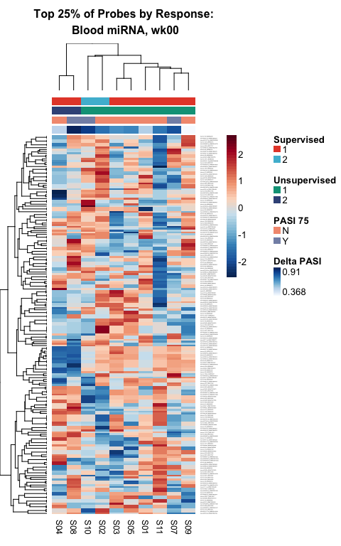

Clusters
================

-   [Overview](#overview)
-   [Load, Prepate Data](#load-prepate-data)
-   [Filtering](#filtering)
-   [t-SNE](#t-sne)
-   [Partitioning Around Medoids](#partitioning-around-medoids)
-   [Mutual Information](#mutual-information)
-   [Heatmap](#heatmap)

All analysis was conducted in R version 3.3.3 using the following script. Computations were performed on a MacBook Pro with 16GB of RAM.

If you haven't already installed the `bioplotr` package, you'll need to do so to reproduce some of the figures below.

``` r
# Install bioplotr
devtools::install_github('dswatson/bioplotr')

# Load libraries, set seed
library(data.table)
library(bioplotr)
library(limma)
library(Rtsne)
library(cluster)
library(infotheo)
library(RColorBrewer)
library(ggsci)
library(NMF)
library(dplyr)
set.seed(123)
```

Overview
========

Once data have been modelled (see [Response]()), we use the outputs of our differential expression analysis to perform supervised and unsupervised clustering on baseline samples in each tissue across all platforms. Our approach is as follows. First, we filter out the bottom half of probes, either by association with biologic response (if supervised) or by leading fold change (if unsupervised). Next, we project the data in two dimensions using *t*-distributed stochastic neighbour embedding (t-SNE) ([van der Maaten & Hinton, 2008](http://www.jmlr.org/papers/volume9/vandermaaten08a/vandermaaten08a.pdf)). Finally, we cluster the samples using *k*-medoids, also known as the PAM algorithm ([Kaufman & Rousseeuw, 1990](https://books.google.co.uk/books/about/Finding_Groups_in_Data.html?id=yS0nAQAAIAAJ)).

Ideally, optimal cluster number *k* would be established via a resampling procedure such as consensus clustering ([Monti et al., 2003](https://pdfs.semanticscholar.org/1f29/553ecbaa388b6be3402bc7af28178f5e24ef.pdf)). However, given our limited sample size, we chose to fix *k* = 2 and test for cluster concordance with clinical outcomes. For simplicity's sake, we will work through a single example here. A complete analysis loop that executes all clustering steps in parallel may be found in this repository's accompanying Clusters.R script.

Load, Prepate Data
==================

``` r
# Import data
mat <- readRDS('./Data/mat_prot.rds')            # Voom transformed counts
fit <- readRDS('./Data/fit_prot.rds')            # Limma model object
clin <- read.csv('./Data/Clinical.csv') %>%      # Clinical data
  distinct(Subject, DeltaPASI, PASI_75)

# Restrict focus to baseline samples
mat <- mat[, grep('wk00', colnames(mat))]
colnames(mat) <- gsub('_wk00', '', colnames(mat))

# Median centre the data
mat <- sweep(mat, 1, apply(mat, 1, median))

# Restrict focus to top half of probes
n_probes <- round(0.5 * nrow(mat))
```

Filtering
=========

This is where supervised and unsupervised approaches diverge. For the former, we simply take the top half of all probes as ranked by *p*-value of the relevant differential expression test.

``` r
top <- topTable(fit, coef = 'wk00.Response', number = n_probes, sort.by = 'p')
hits <- rownames(top)
dm_sup <- dist(t(mat[hits, ]))
```

For unsupervised filtering, we use the leading log fold change method originally developed by the authors of the `limma` package to aid in multidimensional scaling plots ([Ritchie et al., 2015](https://www.ncbi.nlm.nih.gov/pubmed/25605792)). The key insight to this approach is that distance matrices need not be calculated using the same data for all comparisons. Instead, each pairwise distance may be based on the probes for which those two samples most differ. While the `limma` authors employ this method in conjunction with root-mean-square distance, we adopt the Euclidean distance metric here. In fact, the leading fold change filter is a powerful and general tool that can be applied with any distance measure.

``` r
# Create distance matrix
dm_unsup <- matrix(nrow = ncol(mat), ncol = ncol(mat))
for (i in 2:ncol(mat)) {
  for (j in 1:(i - 1)) {
    # Find top most differentially expressed genes between samples i and j
    hits <- order((mat[, i] - mat[, j])^2, decreasing = TRUE)[1:n_probes]
    # Calculate the Euclidean distance between i and j using just those top genes
    dm_unsup[i, j] <- sqrt(sum((mat[hits, i] - mat[hits, j])^2))
  }
}
```

t-SNE
=====

We now perform t-SNE on the distance matrix. This algorithm embeds a high-dimensional manifold in just two dimensions with a focus on preserving local structure, which makes it especially attractive for clustering omic data. We can visualise the projection using the `plot_tsne` function from the `bioplotr` package.

``` r
plot_tsne(mat[rownames(top), ], group = list('PASI 75' = clin$PASI_75), 
          perplexity = 2, label = TRUE,
          title = 'Supervised Filtering: Proteomics, wk00')
```

<p align='center'>

</p>

``` r
plot_tsne(mat, group = list('PASI 75' = clin$PASI_75), 
          top = n_probes, perplexity = 2, label = TRUE,
          title = 'Unsupervised Filtering: Proteomics, wk00')
```

<p align='center'>

</p>

We find in both plots that responders clearly cluster together, although they appear to be quite close to samples S09 and S11 as well, who did not achieve PASI 75 over the course of the study.

Partitioning Around Medoids
===========================

We now perform *k*-medoids clustering, a robust alternative to *k*-means, on the two-dimensional t-SNE projection.

``` r
# Calculate t-SNE projections
tsne_sup <- Rtsne(as.dist(dm_sup), perplexity = 2, theta = 0.1, 
                  check_duplicates = FALSE, is_distance = TRUE)
tsne_unsup <- Rtsne(as.dist(dm_unsup), perplexity = 2, theta = 0.1, 
                    check_duplicates = FALSE, is_distance = TRUE)

# Run PAM
supervised <- pam(tsne_sup$Y, k = 2, cluster.only = TRUE)
unsupervised <- pam(tsne_unsup$Y, k = 2, cluster.only = TRUE)
```

Mutual Information
==================

How concordant are these two clusterings?

``` r
# Confusion matrix
table(supervised, unsupervised)
```

    ##           unsupervised
    ## supervised 1 2
    ##          1 5 0
    ##          2 0 5

Evidently the two methods perfectly coincide. To measure the magnitude of this concordance and compare it with alternative clusterings, we calculate the [mutual information](https://en.wikipedia.org/wiki/Mutual_information) between the two groups in bits.

``` r
# Calculate the mutual information between clusterings
mi <- mutinformation(supervised, unsupervised)

# Convert from nats to bits
(mi <- natstobits(mi))
```

    ## [1] 1

With *k* = 2, the maximal mutual information between groupings is 1 bit. Since these two clusterings are perfectly concordant, this result unsurprising.

Heatmap
=======

These cluster assignments can be visualised along with clinical information as annotation tracks atop a heatmap.

``` r
# Trim matrix
mat <- mat[rownames(top), ]

# Prepare colour palettes
rb <- colorRampPalette(rev(brewer.pal(10, 'RdBu')))(n = 256)
greys <- colorRampPalette(brewer.pal(9, 'Greys'))(n = 256)
d3 <- pal_d3()(6)
cols <- list(greys, d3[1:2], d3[3:4], d3[5:6])

# Build heatmap
aheatmap(mat, distfun = 'pearson', scale = 'row', col = rb, hclustfun = 'average',
         main = paste0('Top 5% of Probes by Response:\n Proteomics, wk00'),
         annCol = list('Delta PASI' = clin$DeltaPASI,
                          'PASI 75' = clin$PASI_75,
                       'Supervised' = supervised,
                     'Unsupervised' = unsupervised),
         annColors = cols, border_color = 'black')
```

<p align='center'>

</p>