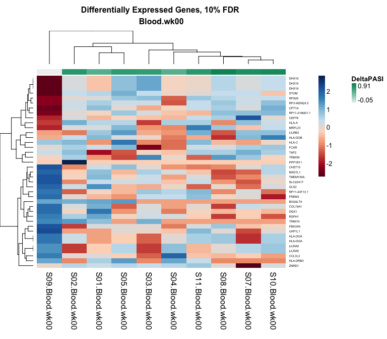
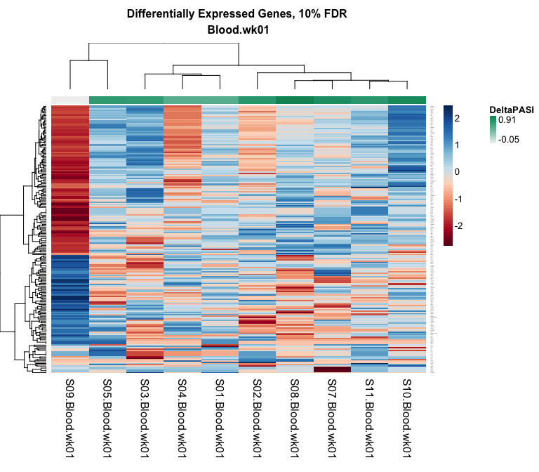
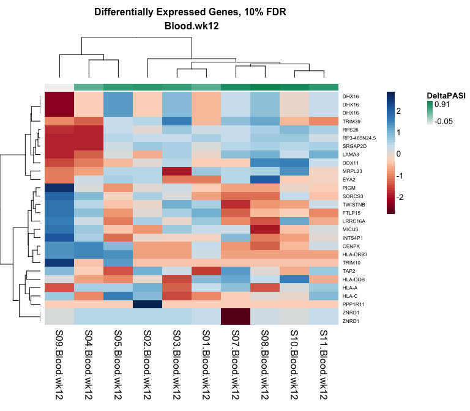
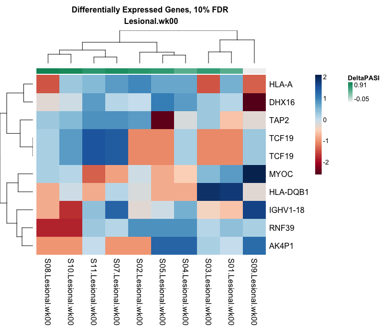
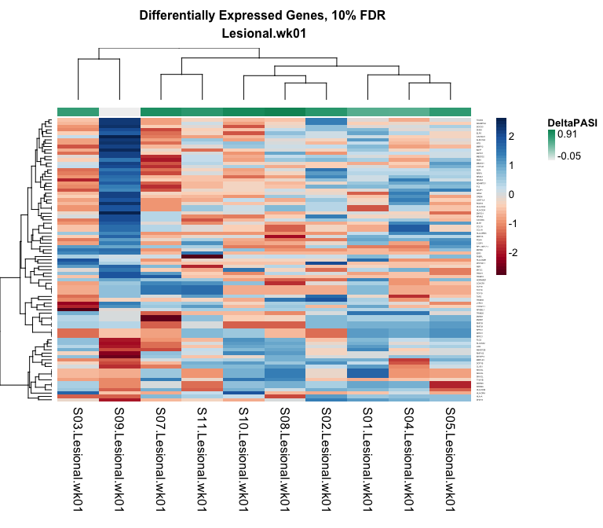
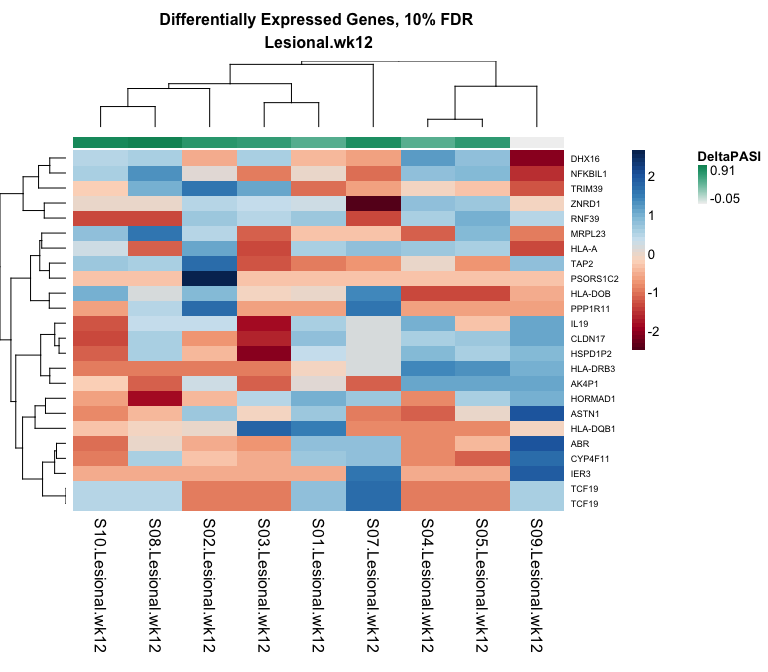
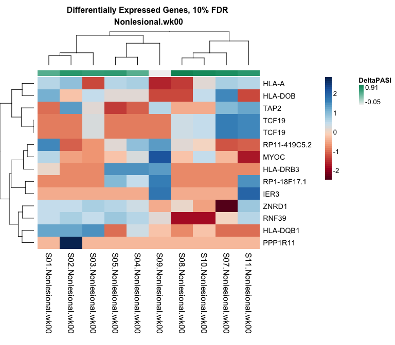
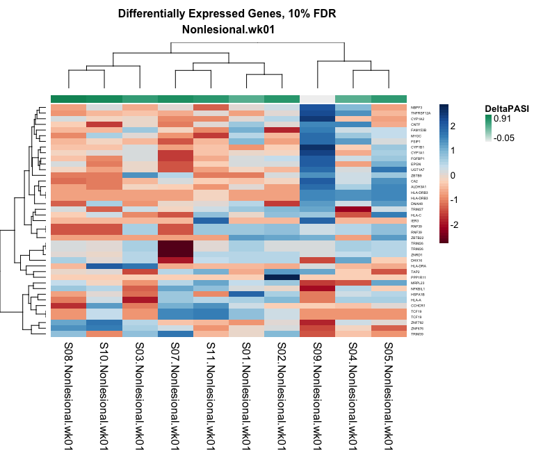
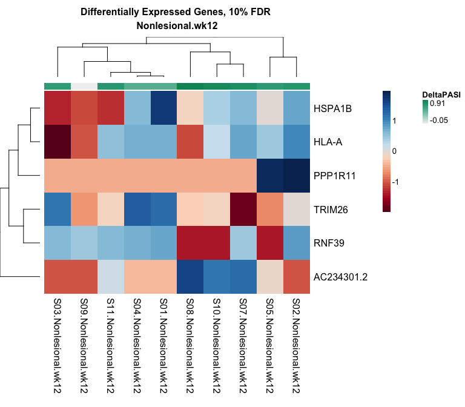

Heatmaps
================

-   [Import Data](#import-data)
-   [Heatmaps](#heatmaps)

All figures were created using R version 3.3.2 using the following script. Computations were performed on a MacBook Pro with 16GB of RAM.

``` r
# Load libraries
library(data.table)
library(RColorBrewer)
library(NMF)
library(dplyr)
```

Import Data
===========

We begin by importing the clinical data file and the gene count matrix, which has been normalised, scaled by library size, and log transformed.

``` r
# Load data
pheno <- fread('./Data/Clinical.csv') %>%
  mutate(Tissue.Time = paste(Tissue, Time, sep = '.'))
mat <- fread('./Data/LCPM_mat.csv') 
genes <- mat$GeneSymbol
mat <- mat[, GeneSymbol := NULL] %>% as.matrix()
rownames(mat) <- genes
```

Heatmaps
========

This function loops through all topTable outputs from our tissue-time comparisons for differential expression by response and generates a heatmap with rows corresponding to genes that pass 10% FDR and columns correpsonding to the 10 samples per contrast.

``` r
# Define colour palette
rb <- colorRampPalette(brewer.pal(10, 'RdBu'))(n = 256)

# Heatmap function
hm <- function(tissuetime) {
  tmp <- pheno %>% filter(Tissue.Time == tissuetime)
  top <- fread(paste0('./Results/Response/', tissuetime, '.txt')) %>%
    filter(q.value < 0.1) %>%
    select(GeneSymbol)
  deg <- mat[top$GeneSymbol, tmp$Sample]
  aheatmap(deg, distfun = 'pearson', scale = 'row', col = rb,
           main = paste0('Differentially Expressed Genes, 10% FDR \n', tissuetime),
           annCol = list(DeltaPASI = tmp$DeltaPASI))
}

for (i in unique(pheno$Tissue.Time)) hm(i)
```

<p align='center'>

</p>
