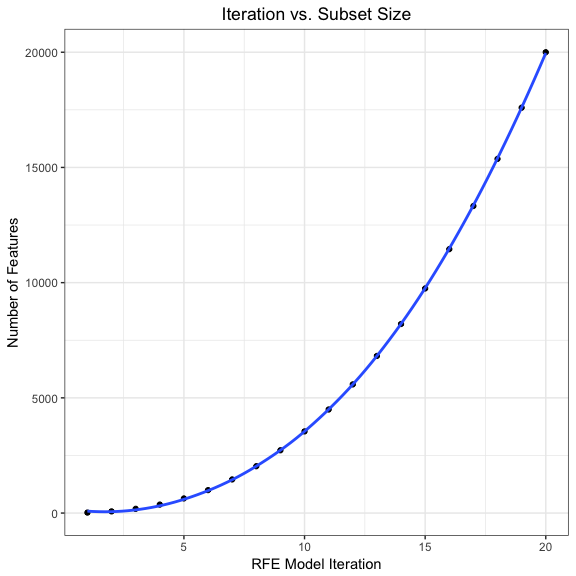
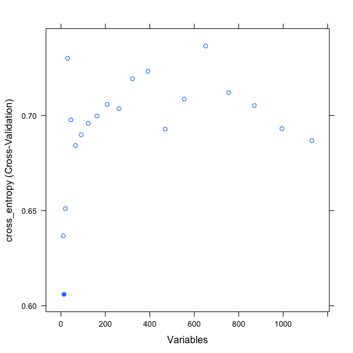
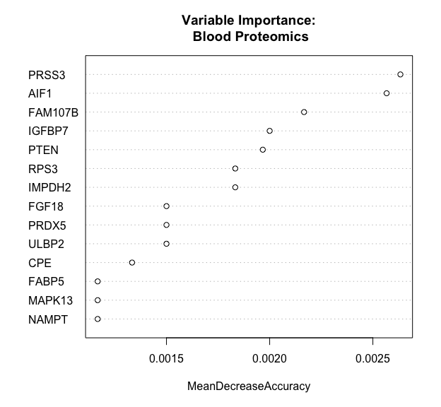
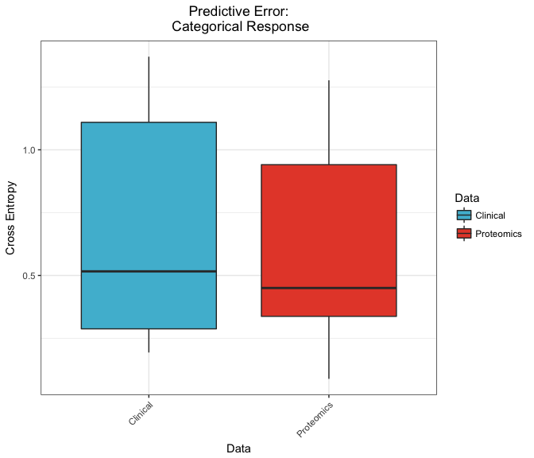

Predictive Modelling
================

-   [Overview](#overview)
-   [Prepare Data, Set Seeds](#prepare-data-set-seeds)
-   [Defining Loss](#defining-loss)
-   [Clinical Model](#clinical-model)
-   [Exploring the Feature Space](#exploring-the-feature-space)
-   [Auxiliary Functions](#auxiliary-functions)
-   [Proteomics Model](#proteomics-model)
-   [Comparing Platforms](#comparing-platforms)

All analysis was conducted in R version 3.4.0 using the following script. Computations were performed on a MacBook Pro with 16GB of RAM and an i7 quad-core processor.

``` r
# Load libraries, register cores
library(randomForest)
library(caret)
library(ggplot2)
library(ggsci)
library(plyr)
library(dplyr)
library(doMC)
registerDoMC(4)
```

Overview
========

One important goal of our study was to predict clinical outcomes based on omic data. Toward that end, we built a series of models using categorical and continuous response measures to compare the predictive power associated with different platforms.

Random forests, originally introduced by [Breiman (2001)](https://link.springer.com/article/10.1023%2FA%3A1010933404324), are a flexible class of tree-based models well suited to high dimensional datasets. They have been shown to perform well in omic contexts when combined with recursive feature elimination ([Díaz-Uriarte & Alvarez de Andrés, 2006](https://bmcbioinformatics.biomedcentral.com/articles/10.1186/1471-2105-7-3)), although care must be taken to avoid selection bias in variable ranking procedures, which may lead to overfitting ([Ambroise & McLachlan, 2002](http://www.pnas.org/content/99/10/6562.short), [Svetnik et al., 2004](https://rd.springer.com/chapter/10.1007%2F978-3-540-25966-4_33)). Below, we use the feature selection methods provided by the [`caret`](https://topepo.github.io/caret/) package for classification and regression training, with a few minor tweaks.

Complete scripts for our model building and testing can can be found in this repository's [PredictError\_Categorical.R](https://github.com/dswatson/PSORT/blob/master/Scripts/PredictiveError_Categorical.R) and [PredictiveError\_Continuous.R](https://github.com/dswatson/PSORT/blob/master/Scripts/PredictiveError_Continuous.R) files. In this document, we compare clinical and proteomic baseline predictors.

Prepare Data, Set Seeds
=======================

``` r
# Import, log transform proteomics matrix
mat <- readRDS('./Data/Prot_RawDat.rds')
mat <- mat[, grepl('wk00', colnames(mat))]
mat <- log2(mat)

# Define response
clin <- read.csv('./Data/Clin_Baseline.csv')
y <- clin$PASI_75
```

Cross-validation is an efficient and unbiased method of estimating a model's test error. It's also highly parallelisable, which is convenient when working with large data sets. To ensure reproducibility, however, we must set seeds for each of our ten folds, plus an eleventh for the final model. See `?caret::trainControl` and `?caret::rfeControl` for more details.

``` r
# Set original seed
set.seed(123)

# Set seeds for trainControl
tr_seeds <- vector(mode = 'list', length = 11)
for (i in seq_len(10)) {
  tr_seeds[[i]] <- sample.int(1000, 3)
}
tr_seeds[[11]] <- sample.int(1000, 1)

# Set seeds for rfeControl
rfe_seeds <- vector(mode = 'list', length = 11)
for (i in seq_len(10)) {
  rfe_seeds[[i]] <- sample.int(1000, 20)
}
rfe_seeds[[11]] <- sample.int(1000, 1)
```

Defining Loss
=============

Random forest classification models are usually trained to minimise out-of-bag (OOB) error, which is essentially an accuracy metric. However, given the class imbalance in our dataset, tuning over this loss function will likely lead to biased results. Instead we minimise the model's [cross entropy](https://en.wikipedia.org/wiki/Cross_entropy), a measure more often associated with logistic regressions and neural networks than random forests.

Cross entropy has a familiar information theoretic interpretation. If we encode the events from probability distribution *P* using a code optimised for some different probability distribution *Q*, then the cross entropy of the two distributions represents the average length of a message in this suboptimal coding scheme. When *P* is a Boolean vector of observed outcomes (i.e., *P* ∈ {0, 1}) and *Q* is a vector of predicted probabilities (i.e., 0 ≤ *Q* ≤ 1), then our cross entropy will equal 0 if and only if *Q* assigns probability 1 to all successes and 0 to all failures. A random classifier, on the other hand, whose predicted probabilities are uniformly distributed between 0 and 1 independent of the true distribution *P*, has an expected cross entropy of 1 (presuming we use natural logarithms).

We define a custom cross entropy function for use in our models below.

``` r
# Define cross entropy loss
cross_entropy <- function(data, lev = NULL, model = NULL) {
  data <- data[complete.cases(data), ]
  pred <- data[, lev[2]]
  eps <- 1e-15
  pred <- pmin(pmax(pred, eps), 1 - eps)
  obs <- ifelse(data$obs == lev[2], 1, 0)
  ce <- -(sum(obs * log(pred) + (1 - obs) * log(1 - pred))) / length(obs)
  c(cross_entropy = ce)
}
```

Clinical Model
==============

Because clinical predictors are relatively few in number, we can use them all in building our first model. The only parameter to tune over in this case is mtry, which represents the number of candidate features included at each split of the tree. See `?randomForest` for more details.

``` r
# Build clinical feature matrix
x <- clin %>% select(-Subject, -DeltaPASI, -PASI_75)
x <- model.matrix(~., data = x)
x <- x[, -1]

# Train model
trCtrl <- trainControl(method = 'cv', summaryFunction = cross_entropy, 
                       classProbs = TRUE, seeds = tr_seeds)
(clin_fit <- train(x, y, method = 'rf', trControl = trCtrl, 
                   tuneGrid = data.frame(.mtry = 4:6), 
                   metric = 'cross_entropy', maximize = FALSE))
```

    ## Random Forest 
    ## 
    ## 10 samples
    ## 26 predictors
    ##  2 classes: 'N', 'Y' 
    ## 
    ## No pre-processing
    ## Resampling: Cross-Validated (10 fold) 
    ## Summary of sample sizes: 9, 9, 9, 9, 9, 9, ... 
    ## Resampling results across tuning parameters:
    ## 
    ##   mtry  cross_entropy
    ##   4     0.6607761    
    ##   5     0.7107179    
    ##   6     0.7038728    
    ## 
    ## cross_entropy was used to select the optimal model using  the
    ##  smallest value.
    ## The final value used for the model was mtry = 4.

The clinical model achieves a cross entropy of 0.66 using 26 predictors. This will be our basis for comparison with omic data.

Exploring the Feature Space
===========================

Recursive feature elimination (RFE) is a general approach to variable selection. The algorithm can be outlined in pseudocode as follows:


For more on RFE, see the instructive chapter in `caret`'s [bookdown documentation](https://topepo.github.io/caret/recursive-feature-elimination.html) or chapter 19 of the accompanying Springer textbook, *Applied Predictive Modeling* ([Kuhn & Johnson, 2013](http://appliedpredictivemodeling.com/)).

In order to efficiently explore the feature space for appropriate subset size, we use a custom function that takes data dimensionality as input and returns a series of 20 integers exponentially approaching that number. This ensures that smaller models are tested more frequently than larger alternatives. The parameters of this function, which include a lower bound of 10 and an exponential decay rate of 2.5, are based on informal testing.

``` r
# Define subsets function
subsets <- function(x) {
  round(10 + ((x - 10) / 20^2.5) * seq_len(20)^2.5)
}

# Print Iteration by SubsetSize data frame
(df <- data.frame(Iteration = seq_len(20),
                 SubsetSize = subsets(2e4)))
```

|  Iteration|  SubsetSize|
|----------:|-----------:|
|          1|          21|
|          2|          73|
|          3|         184|
|          4|         368|
|          5|         635|
|          6|         995|
|          7|        1459|
|          8|        2033|
|          9|        2725|
|         10|        3544|
|         11|        4495|
|         12|        5584|
|         13|        6819|
|         14|        8205|
|         15|        9748|
|         16|       11453|
|         17|       13326|
|         18|       15371|
|         19|       17594|
|         20|       20000|

We see here that the subset size follows a power law distribution, with three quarters of the models containing less than half of all available features. A scatterplot helps visualise this exponential behaviour.

``` r
# Plot Iteration against SubsetSize
ggplot(df, aes(Iteration, SubsetSize)) + 
  geom_point() + 
  geom_smooth(method = 'loess') + 
  labs(title = 'Iteration vs. Subset Size', 
       x = 'RFE Model Iteration', 
       y = 'Number of Features') + 
  theme_bw() + 
  theme(plot.title = element_text(hjust = 0.5))
```

<p align='center'>

</p>

Auxiliary Functions
===================

The `caret` package has an inbuilt routine for RFE with random forests, but we customise a few of these functions before training our model. First, we replace the default OOB error with our aforementioned cross entropy loss.

``` r
# Co-opt inbuilt rfFuncs list
my_rfFuncs <- rfFuncs

# Reassign summary function
my_rfFuncs$summary <- cross_entropy
```

We also update the fit function so that the default number of trees is 1000, not 500.

``` r
my_rfFuncs$fit <- function(x, y, first, last, ...) {
  randomForest(x, y, ntree = 1000, importance = TRUE, ...)
}
```

Finally, we revise the default importance ranking method so that measures are unscaled, which avoids certain unwelcome statistical properties of scaled importance measures with random forest models identified by [Strobl & Zeileis (2008)](https://eeecon.uibk.ac.at/~zeileis/papers/Strobl+Zeileis-2008.pdf).

``` r
my_rfFuncs$rank <- function(object, x, y) {
  imp <- importance(object, type = 1, scale = FALSE)
  data_frame(Overall = imp[, 1], 
             var = rownames(imp)) %>%
    arrange(desc(Overall))
}
```

Proteomics Model
================

With these functions in place, we are now set to train our predictive model on baseline proteomic data.

``` r
# Prepare proteomic data
x <- t(mat)

# Train model
rfeCtrl <- rfeControl(functions = my_rfFuncs, method = 'cv', seeds = rfe_seeds)
(prot_fit <- rfe(x, y, sizes = subsets(ncol(x)), rfeControl = rfeCtrl, 
                 metric = 'cross_entropy', maximize = FALSE))
```

    ## 
    ## Recursive feature selection
    ## 
    ## Outer resampling method: Cross-Validated (10 fold) 
    ## 
    ## Resampling performance over subset size:
    ## 
    ##  Variables cross_entropy cross_entropySD Selected
    ##         11        0.6368          0.4028         
    ##         14        0.6060          0.4075        *
    ##         20        0.6511          0.4388         
    ##         30        0.7301          0.5632         
    ##         45        0.6977          0.5365         
    ##         65        0.6843          0.5118         
    ##         91        0.6899          0.5196         
    ##        123        0.6959          0.5104         
    ##        162        0.6998          0.5047         
    ##        208        0.7059          0.4976         
    ##        261        0.7036          0.4851         
    ##        322        0.7194          0.5198         
    ##        391        0.7233          0.5185         
    ##        469        0.6929          0.4514         
    ##        555        0.7087          0.4978         
    ##        651        0.7366          0.5142         
    ##        755        0.7120          0.4857         
    ##        870        0.7052          0.4804         
    ##        994        0.6931          0.4587         
    ##       1129        0.6869          0.4478         
    ## 
    ## The top 5 variables (out of 14):
    ##    SERPINA4, IMPDH2, RPS3, PRDX5, PTEN

The best model selected just 14 out of 1129 features, resulting in a cross-validated test error of 0.61. That means this classifier is more predictive than clinical data using just about half as many features.

Variable Importance Plots

We can see how error relates to variable subset size with the following plot.

``` r
plot(prot_fit)
```

<p align='center'>

</p>

First of all, note that most error rates fall within a fairly tight range near the maximum of the cross entropy distribution. Only three models, all with relatively few variables, are anywhere near the 0.65 threshold. This validates our decision to examine the sparse regions of the feature space more closely than the upper ranges.

To learn a little more about the relative contributions of the features in our model, we can examine a variable importance plot.

``` r
# Build random forest model
rf <- randomForest(x, y, ntree = 1000, importance = TRUE)

# Plot variables by importance
varImpPlot(rf, type = 1, scale = FALSE, n.var = 14,
           main = 'Variable Importance:\n Blood Proteomics')
```

<p align='center'>

</p>

This figure provides a good overview of the strongest biomarkers in our dataset. These results, in combination with our differential expression analysis, highlight several analytes worth further investigation in follow up studies.

Comparing Platforms
===================

To compare this model's test error with that of our clinical model, we build the following box plot.

``` r
data.frame(Data = factor(rep(c('Clinical', 'Proteomics'), each = 10)),
           Loss = c(clin_fit$resample$cross_entropy,
                    prot_fit$resample$cross_entropy)) %>%
  ggplot(aes(Data, Loss, fill = Data)) + 
  geom_boxplot() + 
  scale_fill_manual(values = pal_npg()(2)[c(2, 1)]) + 
  labs(title = 'Predictive Error:\n Categorical Response',
       y = 'Cross Entropy') + 
  theme_bw() + 
  theme(plot.title = element_text(hjust = 0.5),
        axis.text.x = element_text(angle = 45, hjust = 1))
```

<p align='center'>

</p>

Observe how error rates are quite variable across folds, ranging from a minimum of 0.09 -- nearly perfect -- to a maximum of 1.28 -- worse than random. This kind of volatility is not uncommon in small datasets, where the inclusion or exclusion of a single sample can have a major impact on results. Future research should apply these methods to larger cohorts, where the predictive performance of particular platforms can be estimated with greater power.
