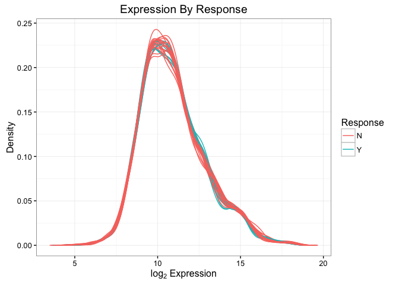
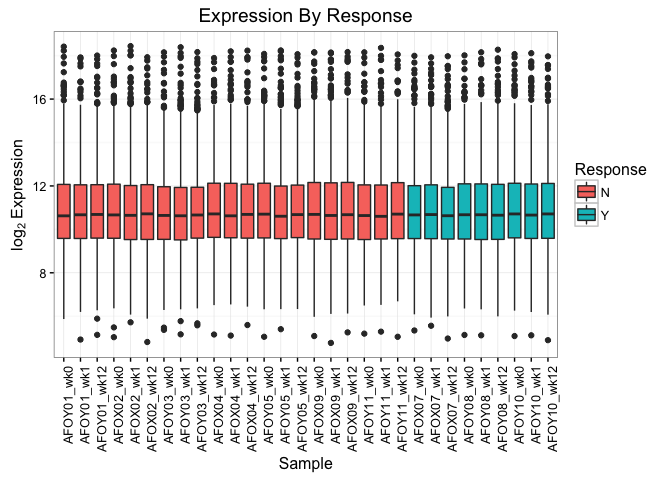
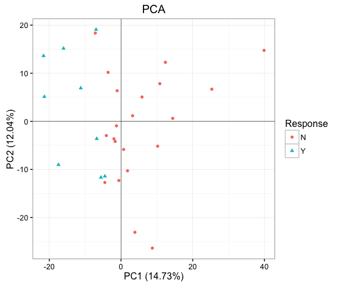
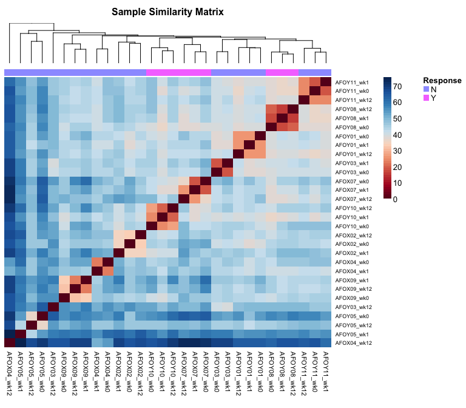

Proteomic Data 
==============
Preliminary Review
------------------

-   [Data](#data)
-   [Diagnostic Plots](#diagnostic-plots)
-   [Conclusion](#conclusion)

All analysis was conducted in R version 3.3.1 using the following script. Computations were performed on a MacBook Pro with 16GB of RAM.

``` r
# Load libraries
library(ggplot2)
library(wordspace)
library(RColorBrewer)
library(NMF)
library(tidyr)
library(dplyr)
```

Data
====

Raw data from all samples were log transformed prior to analysis.

``` r
# Proteomic data
mat <- as.matrix(read.csv(paste0(getwd(), '/Data/SomaScan.csv')))
lmat <- log2(mat)

# Clinical data
pheno <- read.csv(paste0(getwd(), '/Data/PrePSORT_Clinical.csv'))
```

There's been much discussion over proper measures of patient response for this study. While we will most likely be using delta PASI as a continuous response measure for differential expression testing of transcriptomic data, the following QC plots use PASI 75 as a categorical response indicator. This is simply for easier visualisation purposes and should not make any difference to downstream inferential analytics.

Diagnostic Plots
================

Following log transformation, we performed a variety of exploratory data analyses to check for outliers and ensure data quality.

Density Plot
------------

We begin with a simple density plot, coloured by response

``` r
# Shape data
X <- Y <- matrix(0, 512, ncol(lmat))
  for (j in 1:ncol(lmat)) {
    d <- density(lmat[, j], na.rm=TRUE)
    X[, j] <- d$x
    Y[, j] <- d$y
  }

dat <- data.frame(Response = rep(pheno$PASI_75, each=512), gather(data.frame(X), Sample, Expr),
                  Density = gather(data.frame(Y), Sample, Density) %>% select(Density))

# Plot results
ggplot(dat, aes(Expr, Density, group=Sample, colour=Response)) + geom_path() + theme_bw() +
  labs(title='Expression By Response', x=expression('log'[2]*' Expression'))
```

<p align='center'>

</p>

We find here that the data are all approximately log-normally distributed, with no clear differences between responders and non-responders. There are also no obvious outliers in these data, at least not judging by this density plot.

Box Plot
--------

Visualising the same data in box plot form generates the following figure.

``` r
# Shape data
dat <- data.frame(Response = rep(pheno$PASI_75, each=nrow(lmat)),
                  gather(data.frame(lmat), Sample, Expr)) %>%
  arrange(Response)
dat$Sample <- factor(dat$Sample, levels=unique(dat$Sample))

# Plot results
ggplot(dat, aes(Sample, Expr, fill=Response)) + geom_boxplot() + theme_bw() +
  theme(axis.text.x=element_text(angle=90, hjust=1)) +
  labs(title='Expression By Response', y=expression('log'[2]*' Expression'))
```

<p align='center'>

</p>

We see little variability within the response group, and not much more in the larger non-response group.

Principal Component Analysis
----------------------------

To get a better sense of the data's latent structure, it helps to reduce dimensionality using principal components.

``` r
# Shape data
pca <- prcomp(t(lmat), center=TRUE, scale.=TRUE)
dat <- data.frame(pca$x[, 1:2], Response=pheno$PASI_75)
imp1 <- round(summary(pca)$importance['Proportion of Variance', 1] * 100, 2)
imp2 <- round(summary(pca)$importance['Proportion of Variance', 2] * 100, 2)

# Plot results
ggplot(dat, aes(PC1, PC2, colour=Response, shape=Response)) + geom_point() + 
  geom_hline(yintercept=0, size=.2) + geom_vline(xintercept=0, size=.2) + theme_bw() + 
  labs(title='PCA', x=paste0('PC1 (', imp1, '%)'), y=paste0('PC2 (', imp2, '%)'))
```

<p align='center'>

</p>

There is some clear evidence of clustering by response in the principal component subspace, which captures over a quarter of the data's variance in just two dimensions.

Sample Similarity Heatmap
-------------------------

We build a sample similarity matrix by calculating the pairwise Euclidean distance between all samples in the data and visualising the results with a heatmap and hierarchical clustering dendrogram.

``` r
# Shape data
dm <- dist.matrix(scale(t(lmat)), method='euclidean')

# Choose colour palette
rb <- colorRampPalette(brewer.pal(10, 'RdBu'))(n=256)

# Plot results
aheatmap(dm, col=rb, Rowv=FALSE, annCol=list(Response = pheno$PASI_75), 
  distfun=function(x) as.dist(x), hclustfun='average', main='Sample Similarity Matrix')
```

<p align='center'>

</p>

Samples tend to cluster by subject, which is reassuring. The track at the top indicates that while hierarchical clustering has failed to perfectly segregate responders from non-responders, there is a large clade at the left of samples that fall under the PASI 75 threshold.

Conclusion
==========

These diagnostic plots reveal no apparent quality control issues in the data. PCA and hierarchical clustering both provide encouraging results, suggesting that there is some proteomic signature of response to be uncovered here. We look forward to learning more in downstream analysis.
