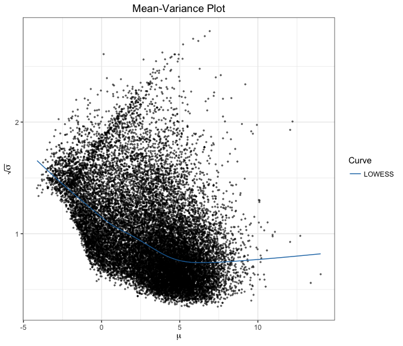
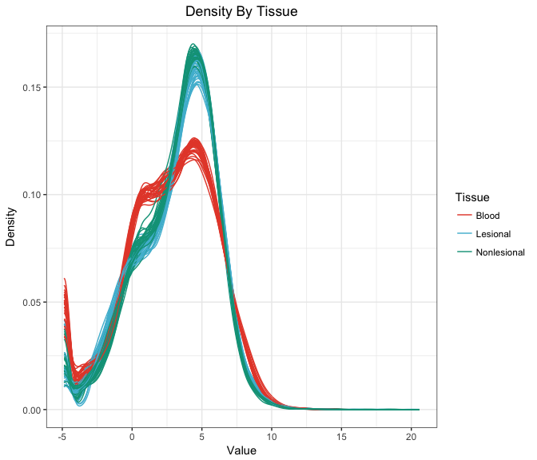
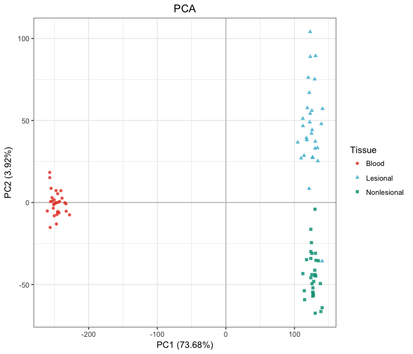
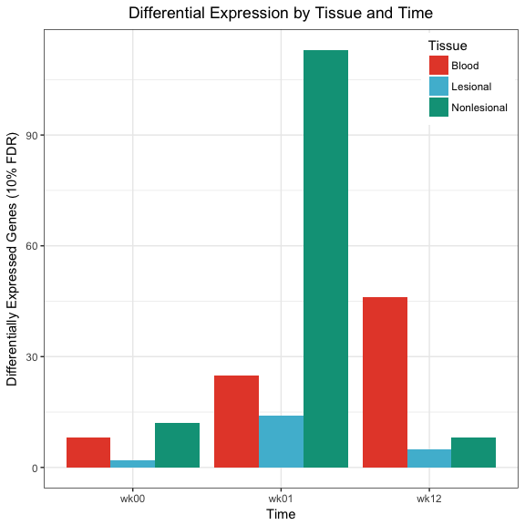

Differential Expression by Biologic Response
================

-   [Import Data](#import-data)
-   [Preprocessing](#preprocessing)
-   [Exploratory Data Analysis](#exploratory-data-analysis)
-   [Models](#models)
-   [Differential Expression Analysis](#differential-expression-analysis)

All analysis was conducted in R version 3.4.0 using the following script. Computations were performed on a MacBook Pro with 16GB of RAM and an i7 quad-core processor.

If you haven't already installed the `bioplotr` package, you'll need to do so to reproduce some of the figures below.

``` r
# Install bioplotr
devtools::install_github('dswatson/bioplotr')

# Load libraries
library(data.table)
library(tximport)
library(edgeR)
library(limma)
library(ggplot2)
library(bioplotr)
library(ggsci)
library(qvalue)
library(dplyr)
```

Import Data
===========

Following RNA-seqencing of all samples, reads were pseudo-aligned using kallisto ([Bray et al., 2016](http://www.nature.com/nbt/journal/v34/n5/full/nbt.3519.html)). Our reference genome was [GRCh38.p2](http://mar2015.archive.ensembl.org/Homo_sapiens/Info/Index), Ensembl version 79. Transcript-level reads were aggregated to gene-level using the `tximport` package ([Soneson et al., 2015](https://f1000research.com/articles/4-1521/v2)). We add a subject-tissue interaction term to the clinical data file for later use.

``` r
# Load data
clin <- fread('./Data/Clinical.csv') %>%
  mutate(Subject.Tissue = paste(Subject, Tissue, sep = '.'))
t2g <- fread('./Data/Hs79.t2g.csv')
files <- file.path('./Data/RawCounts', clin$Sample, 'abundance.tsv')
txi <- tximport(files, type = 'kallisto', tx2gene = t2g, importer = fread, 
                countsFromAbundance = 'lengthScaledTPM')
```

Preprocessing
=============

We modify genetic and clinical data prior to modelling.

Filter, Normalise Counts
------------------------

Before conducting EDA or differential expression analysis, we remove probes with less than one count per million (CPM) in at least nine libraries. This ensures that every probe is expressed in at least one of our nine replicates per subject (three tissue types observed at three timepoints each). This threshold follows the filtering guidelines of [Robinson et al. (2010)](https://www.ncbi.nlm.nih.gov/pubmed/19910308). Counts are then TMM normalised prior to modelling ([Robinson & Oshlack, 2010](https://genomebiology.biomedcentral.com/articles/10.1186/gb-2010-11-3-r25)). See the extensive `edgeR` [package vignette](https://www.bioconductor.org/packages/3.3/bioc/vignettes/edgeR/inst/doc/edgeRUsersGuide.pdf) for more details.

``` r
# Filter genes
keep <- rowSums(cpm(txi$counts) > 1) >= 9
y <- DGEList(txi$counts[keep, ])
y <- calcNormFactors(y)
colnames(y) <- clin$Sample

# Check dimensionality
dim(y)
```

    ## [1] 19304    89

The analysis will proceed with 19,304 probes.

Robustify Response Metrics
--------------------------

To get a quick sense for the clinical data, we create scatterplots of baseline vs. 12 week PASI and baseline vs. delta PASI.

``` r
# Create per-subject data frame
df <- clin %>% distinct(Subject, PASI_wk00, PASI_wk12, DeltaPASI)

# Regress 12 week PASI on baseline
m <- lm(PASI_wk12 ~ 0 + PASI_wk00, data = df)

# Plot results
ggplot(df, aes(PASI_wk00, PASI_wk12, label = Subject)) + 
  geom_text() + 
  geom_abline(intercept = 0, slope = 1) + 
  geom_abline(intercept = 0, slope = coef(m), colour = 'blue') + 
  xlim(0, 40) + ylim(0, 40) + 
  labs(title = 'Baseline vs. 12 Week PASI',
           x = 'Baseline PASI',
           y = '12 Week PASI') + 
  theme_bw() + 
  theme(plot.title = element_text(hjust = .5))
```

<p align='center'>

</p>

The black line has an intercept of 0 and a slope of 1, representing zero improvement over the course of treatment. We find that only one subject, S09, falls to the left of this line. The blue line has an intercept of 0 and a slope corresponding to the line of best fit through the data points. To obtain a least squares estimate of the average percent change in PASI observed in our study, we calculate the difference in slope between the black and blue lines.

``` r
as.numeric(1 - coef(m))
```

    ## [1] 0.6917699

Subjects in our study experienced a 69% reduction in PASI scores over the course of treatment, on average. It's evident from this plot, however, that there is considerable variance around that mean. S09 in particular appears to be an outlier. Note that this patient is the only one in the study who got worse between baseline and week 12. It is important that our model capture genomic signatures of non-response, but the distance between this patient's outcome and the nearest fellow non-responder is disconcertingly large. As we see in the following plot, S09 singlehandedly creates the impression of a relationship between baseline and outcome statistics.

``` r
# Regress delta PASI on baseline, with and without S09
m1 <- lm(DeltaPASI ~ PASI_wk00, data = df)
m2 <- lm(DeltaPASI ~ PASI_wk00, data = filter(df, Subject != 'S09'))

# Plot baseline vs. delta PASI
ggplot(df, aes(PASI_wk00, DeltaPASI, label = Subject)) + 
  geom_text() + 
  geom_abline(intercept = coef(m1)[1], slope = coef(m1)[2]) + 
  geom_abline(intercept = coef(m2)[1], slope = coef(m2)[2], colour = 'blue') + 
  labs(title = 'Baseline vs. Delta PASI',
           x = 'Baseline PASI',
           y = 'Delta PASI') +
  theme_bw() + 
  theme(plot.title = element_text(hjust = .5))
```

<p align='center'>

</p>

The black line represents the regression of delta PASI on baseline for all subjects in the study; the blue line represents the same model, excluding S09. Note how the latter line is practically flat, while the former has a clear positive slope. Correlations between these variables are heavily affected by the presence or absence of this single data point.

``` r
cor(df$PASI_wk00, df$DeltaPASI)
```

    ## [1] 0.2612898

``` r
cor(df$PASI_wk00[df$Subject != 'S09'], df$DeltaPASI[df$Subject != 'S09'])
```

    ## [1] -0.007712975

Early attempts at this analysis found that subject 9 was driving differential expression results due to the patient's high leverage in least squares regression modelling. Rather than remove the patient altogether, we elect to winsorise the distribution, replacing S09's delta PASI score with a lower limit defined as two median absolute deviations below the median of all delta PASI scores.

``` r
# Create function
winsorise <- function(x, multiple = 2) {
  y <- x - median(x)
  lim <- mad(y, center = 0) * multiple
  y[y > lim] <- lim
  y[y < -lim] <- -lim
  y <- y + median(x)
  return(y)
}

# Check to see which patient outcomes are changed by winsorisation
(df <- clin %>%
  distinct(Subject, DeltaPASI) %>%
  mutate(Winsorised = winsorise(DeltaPASI)))
```

| Subject |   DeltaPASI|  Winsorised|
|:--------|-----------:|-----------:|
| S01     |   0.5172414|   0.5172414|
| S02     |   0.7346154|   0.7346154|
| S03     |   0.6736111|   0.6736111|
| S04     |   0.5023697|   0.5023697|
| S05     |   0.6948229|   0.6948229|
| S07     |   0.8009709|   0.8009709|
| S08     |   0.9100000|   0.9100000|
| S09     |  -0.0468750|   0.3677652|
| S10     |   0.8459120|   0.8459120|
| S11     |   0.7222222|   0.7222222|

This confirms that only subject 9 meets our winsorisation threshold. The patient's results are still by far the most extreme in the data, but have now been robustified for linear modelling.

``` r
# Winsorise the distribution
clin <- clin %>%
  group_by(Tissue, Time) %>%
  mutate(DeltaPASI = winsorise(DeltaPASI)) %>%
  ungroup()
```

Exploratory Data Analysis
=========================

All EDA is conducted on the log2-CPM scale of the normalised count matrix.

``` r
mat <- cpm(y, log = TRUE, prior.count = 1)
```

Mean-Variance Trend
-------------------

We begin by examining the data's mean-variance trend, as the shape of this curve is essential for the `voom` weights we intend to apply before testing for differential expression.

``` r
plot_mv(mat, trans = 'sqrt')
```

<p align='center'>

</p>

This plot looks about right for these data.

Density Plot
------------

While a mean-variance plot tells us something about the distribution of counts by gene, a density plot helps visualise the distribution of counts by sample. I've chosen to colour the densities by tissue type, since this is evidently the greatest source of variation in the data.

``` r
plot_density(mat, group = list('Tissue' = clin$Tissue))
```

<p align='center'>

</p>

We find here that blood samples take a unique shape, while skin samples are generally more alike. Still, nonlesional tissue appears to have a slightly higher peak than lesional tissue. There are no clear outliers in this figure, but we cannot make a conclusive judgment about this without further exploration.

Sample Similarity Matrix
------------------------

We build a sample similarity matrix by calculating the pairwise Euclidean distance between all samples in the data. This matrix is then visualised as a heatmap and used to generate a hierarchical clustering dendrogram.

``` r
plot_similarity(mat, group = list('Tissue' = clin$Tissue))
```

<p align='center'>

</p>

The dendrogram has perfectly separated blood from skin, which is reassuring. Hierarchical clustering has had more trouble distinguishing between lesional and nonlesional samples, but this appears to be the result of strong intra-subject effects. A paired test would almost certainly find large differential expression between these two types of skin samples.

Principal Component Analysis
----------------------------

One final, popular method for visualising the variance of a high-dimensional dataset along just two axes is principal component analysis (PCA).

``` r
plot_pca(mat, group = list('Tissue' = clin$Tissue))
```

<p align='center'>

</p>

This plot represents perhaps the clearest possible summary of the findings from the last few figures. The first principal component, which captures over 70% of the variance in these data, perfectly separates blood from skin samples. The second principal component, which accounts for a little over 9% of the data variance, separates lesional from nonlesional tissue, albeit with one stray data point corresponding to S03's week 12 observation. While this subject did not achieve PASI 75, he did come quite close. Transcriptomic evidence suggests he may have been on his way to positive biologic response, given the proximity of his final lesional sample to nonlesional tissue.

Models
======

We examine between-subject variation across tissue types and time points by fitting a linear model, shrinking residual variance using empirical Bayes methods, and extracting the appropriate contrasts ([Smyth, 2004](http://www.statsci.org/smyth/pubs/ebayes.pdf)).

Design Matrix
-------------

``` r
# Build design matrix
des <- model.matrix(~ 0 + Tissue:Time + Tissue:Time:DeltaPASI, data = clin)
colnames(des)[10:18] <- paste(unique(clin$Tissue), rep(unique(clin$Time), each = 3),
                              'Response', sep = '.')
```

This design matrix has 18 columns. The first 9 represent every tissue-time combination, effectively providing intercepts for each of the 9 sub-models of which the model is composed. The latter 9 are three-way interactions between tissue type, time point, and delta PASI, which we use to measure drug response. The coefficients for these features represent the slopes of each linear sub-model. We rename these variables for more convenient reference later on.

Sample Weights
--------------

With 89 samples in our study collected from different tissues at various times, it's distinctly possible that there's significant variation in quality across libraries. The authors of the `limma` package originally introduced an `arrayWeights` function for microarray data so users could empirically estimate sample weights to incorporate in heteroscedastic linear model fits ([Ritchie et al., 2006](http://bmcbioinformatics.biomedcentral.com/articles/10.1186/1471-2105-7-261)). Shortly after introducing the `voom` transformation, which allows RNA-seq count matrices to be modeled in the `limma` pipeline ([Law et al., 2014](https://genomebiology.biomedcentral.com/articles/10.1186/gb-2014-15-2-r29)), the package authors extended Ritchie et al.'s sample weighting procedure to RNA-seq data ([Liu et al., 2015](http://nar.oxfordjournals.org/content/early/2015/04/28/nar.gkv412.full)). We can check for variability in library quality by plotting the results of a preliminary estimation of `voom` sample weights.

``` r
# Estimate weights
v <- voomWithQualityWeights(y, des)

# Tidy data
df <- data_frame(Sample = paste0('S', seq_len(89)),
                 Tissue = clin$Tissue,
                 Weight = as.numeric(v$sample.weights)) %>%
  mutate(Sample = factor(Sample, levels = unique(Sample)))

# Plot results
ggplot(df, aes(Sample, Weight, fill = Tissue)) +
  geom_bar(stat = 'identity') + 
  scale_fill_npg() + 
  geom_hline(yintercept = 1, linetype = 'dashed') + 
  labs(title = 'Library Quality by Tissue') + 
  theme_bw() + 
  theme(axis.text.x = element_text(angle = 45, hjust = 1),
        plot.title = element_text(hjust = .5),
        legend.justification = c(0.01, 0.99), 
        legend.position = c(0.01, 0.99))
```

<p align='center'>

</p>

Library quality does seem to vary across samples, but it's not entirely clear whether that's a function of tissue, time, the interaction between them, or perhaps even subject. To find out, we run a series of *F*-tests. The first three are repeated measures ANOVAs, the latter a simple one-way ANOVA. (Technically, we should remove subject 11 from the repeated measures ANOVAs since this patient's week 12 lesional sample is NA; in practice, it makes no difference here.)

``` r
df <- df %>%
  mutate(Subject = clin$Subject,
            Time = clin$Time)

# Do sample weights vary significantly by tissue?
anova(lm(Weight ~ Subject + Tissue, data = df),
      lm(Weight ~ Subject, data = df))
```

|  Res.Df|       RSS|   Df|  Sum of Sq|         F|  Pr(&gt;F)|
|-------:|---------:|----:|----------:|---------:|----------:|
|      77|  6.811668|   NA|         NA|        NA|         NA|
|      79|  8.182313|   -2|  -1.370644|  7.746971|  0.0008601|

``` r
# By time?
anova(lm(Weight ~ Subject + Time, data = df),
      lm(Weight ~ Subject, data = df))
```

|  Res.Df|       RSS|   Df|   Sum of Sq|         F|  Pr(&gt;F)|
|-------:|---------:|----:|-----------:|---------:|----------:|
|      77|  7.949054|   NA|          NA|        NA|         NA|
|      79|  8.182313|   -2|  -0.2332586|  1.129752|  0.3284098|

``` r
# By tissue-time?
anova(lm(Weight ~ Subject + Tissue:Time, data = df),
      lm(Weight ~ Subject, data = df))
```

|  Res.Df|       RSS|   Df|  Sum of Sq|         F|  Pr(&gt;F)|
|-------:|---------:|----:|----------:|---------:|----------:|
|      71|  6.210653|   NA|         NA|        NA|         NA|
|      79|  8.182313|   -8|   -1.97166|  2.817494|  0.0090095|

``` r
# By subject?
anova(lm(Weight ~ Subject, data = df),
      lm(Weight ~ 1, data = df))
```

|  Res.Df|       RSS|   Df|  Sum of Sq|         F|  Pr(&gt;F)|
|-------:|---------:|----:|----------:|---------:|----------:|
|      79|  8.182313|   NA|         NA|        NA|         NA|
|      88|  9.540588|   -9|  -1.358276|  1.457124|  0.1787251|

It appears from these *F*-tests that tissue type is the main driver of variation in library quality. This is true even though the design matrix passed to `voomWithQualityWeights` includes a Tissue:Time interaction term, meaning residual sample variance is only calculated in comparison to other libraries from the same tissue-time. Because the variability is considerable - the minimum and maximum weights differ by a factor of five - we elect to build a heteroscedastic model that will take sample weights into account.

Random Effect
-------------

To account for the intra-subject correlations inherent to our study's repeated measures design, we use the `duplicateCorrelation` function. This approximates a mixed model in which a blocking variable, in this case the interaction between subject and tissue type, becomes a random effect ([Smyth, 2005](http://www.statsci.org/smyth/pubs/dupcor.pdf)). Following the [advice of the package authors](https://support.bioconductor.org/p/59700/), we estimate `voom` weights and block correlations twice each.

``` r
icc <- duplicateCorrelation(v, des, block = clin$Subject.Tissue)
v <- voomWithQualityWeights(y, des, correlation = icc$cor, 
                            block = clin$Subject.Tissue)
icc <- duplicateCorrelation(v, des, block = clin$Subject.Tissue)
```

It's worth checking to see how high the intra-class correlation is just to confirm it's a positive real number on (0, 1).

``` r
icc$cor
```

    ## [1] 0.3210134

That value seems plausible, and confirms that we are right to use this approach. The positive correlation of expression values within each subject-tissue violates the assumption of independence upon which fixed effect models are based.

Genewise Regressions
--------------------

With all these pieces in place, all that's left to do is fit the genewise regressions. We write a custom function to export results.

``` r
res <- function(coef) {
  topTable(fit, coef = coef, number = Inf, sort.by = 'none') %>%
    rename(AvgExpr = AveExpr,
           p.value = P.Value) %>%
    mutate(q.value = qvalue(p.value)$qvalues,
              Gene = rownames(v)) %>%
    arrange(p.value) %>%
    select(Gene, AvgExpr, logFC, p.value, q.value) %>%
    fwrite(paste0('./Results/Response/mRNA/', coef, '.txt'), sep = '\t')
}
```

We now fit the model and export results for each tissue-time. We use a robust empirical Bayes shrinkage procedure to mitigate the impact of hypervariable genes ([Phipson et al., 2016](https://arxiv.org/abs/1602.08678)).

``` r
fit <- lmFit(v, des, correlation = icc$cor, block = clin$Subject.Tissue)
fit <- eBayes(fit)
for (j in colnames(des)[10:18]) res(j)
```

In addition to exporting the results file, we also save the final voom-transformed matrix and model object to disk for later use. This will save considerable time when clustering and plotting figures.

``` r
saveRDS(v$E, './Data/mat_mRNA.rds')
saveRDS(fit, './Data/fit_mRNA.rds')
```

Differential Expression Analysis
================================

To get an overview of how many genes are declared differentially expressed across all our contrasts at 10% FDR, we build the following summary table.

``` r
(df <- clin %>%
  distinct(Tissue, Time) %>%
  rowwise() %>%
  mutate(DEgenes = fread(paste0('./Results/Response/mRNA/',
                                Tissue, '_', Time, '.Response.txt')) %>%
                     summarise(sum(q.value <= 0.1)) %>%
                     as.numeric()) %>%
  as.data.frame())
```

| Tissue      | Time |  DEgenes|
|:------------|:-----|--------:|
| Blood       | wk00 |        8|
| Blood       | wk01 |       25|
| Blood       | wk12 |       46|
| Lesional    | wk00 |        2|
| Lesional    | wk01 |       14|
| Lesional    | wk12 |        5|
| Nonlesional | wk00 |       12|
| Nonlesional | wk01 |      113|
| Nonlesional | wk12 |        8|

It appears there are signs of differential expression at each tissue-time, but the signal is somewhat uneven. To get a better sense for these results, it helps to visualise them as a bar plot.

``` r
ggplot(df, aes(Time, DEgenes, fill = Tissue)) + 
  geom_bar(stat = 'identity', position = 'dodge') + 
  scale_fill_npg() + 
  labs(title = 'Differential Expression by Tissue and Time',
           y = 'Differentially Expressed Genes (10% FDR)') + 
  theme_bw() + 
  theme(plot.title = element_text(hjust = .5),
        legend.justification = c(0.99, 0.99), 
        legend.position = c(0.99, 0.99))
```

<p align='center'>

</p>

We find here that while transcriptomic signatures of response seem to get stronger in blood as time goes on, they peak in lesional and nonlesional skin at week 1. Nonlesional skin in particular shows an especially strong signal after one week's exposure to etanercept. We are especially interested in identifying predictive biomarkers, however, which is why in what follows we will focus on baseline measures.
