Differential Expression by Biologic Response
================

-   [Import Data](#import-data)
-   [Preprocessing](#preprocessing)
-   [Exploratory Data Analysis](#exploratory-data-analysis)
-   [Models](#models)
-   [Differential Expression Analysis](#differential-expression-analysis)

All analysis was conducted in R version 3.3.2 using the following script. Computations were performed on a MacBook Pro with 16GB of RAM.

If you haven't already installed the `bioplotr` package, you'll need to do so to reproduce some of the figures below.

``` r
# Install bioplotr
devtools::install_github('dswatson/bioplotr')

# Load libraries
library(bioplotr)
library(data.table)
library(tximport)
library(edgeR)
library(limma)
library(qvalue)
library(qqman)
library(RColorBrewer)
library(NMF)
library(tidyverse)
```

Import Data
===========

Following RNA-seqencing of all samples, reads were pseudo-aligned using kallisto ([Bray et al., 2016](http://www.nature.com/nbt/journal/v34/n5/full/nbt.3519.html)). Our reference genome was [GRCh38.p2](http://mar2015.archive.ensembl.org/Homo_sapiens/Info/Index), Ensembl version 79. Transcript-level reads were aggregated to gene-level using the `tximport` package ([Soneson et al., 2015](https://f1000research.com/articles/4-1521/v2)). We add a Subject-Tissue interaction term to the clinical data file for later use.

``` r
# Load data
pheno <- fread('./Data/Clinical.csv') %>%
  mutate(Subject.Tissue = paste(Subject, Tissue, sep = '.')) %>%
  data.table()
t2g <- fread('./Data/Ensembl.Hs79.Tx.csv')
e2g <- fread('./Data/Ensembl.Hs79.GeneSymbols.csv')
files <- file.path('./Data/RawCounts', pheno$Sample, 'abundance.tsv')
txi <- tximport(files, type = 'kallisto', tx2gene = t2g, reader = fread, 
                countsFromAbundance = 'lengthScaledTPM')
```

Preprocessing
=============

Before conducting EDA or differential expression analysis, we remove genes with less than one count per million (CPM) in at least nine libraries. This ensures that every gene is expressed in at least one of our nine replicates per subject (three tissue types observed at three timepoints each). This threshold follows the filtering guidelines of [Robinson et al. (2010)](https://www.ncbi.nlm.nih.gov/pubmed/19910308). Counts are then TMM normalised prior to modeling ([Robinson & Oshlack, 2010](https://genomebiology.biomedcentral.com/articles/10.1186/gb-2010-11-3-r25)). See the extensive `edgeR` [package vignette](https://www.bioconductor.org/packages/3.3/bioc/vignettes/edgeR/inst/doc/edgeRUsersGuide.pdf) for more details.

``` r
# Filter genes
keep <- rowSums(cpm(txi$counts) > 1) >= 9
y <- DGEList(txi$counts[keep, ])
y <- calcNormFactors(y)
```

To get a quick sense for the clinical data, we create a scatterplot of baseline PASI vs. delta PASI.

``` r
# Create per-subject data frame
df <- pheno %>% distinct(Subject, PASI_wk00, DeltaPASI)

# Plot baseline vs. delta PASI
ggplot(df, aes(PASI_wk00, DeltaPASI, label = Subject)) + 
  geom_text() + 
  labs(title = 'Baseline vs. Delta PASI',
       x = 'Baseline PASI',
       y = 'Delta PASI') +
  theme_bw()
```

<p align='center'>
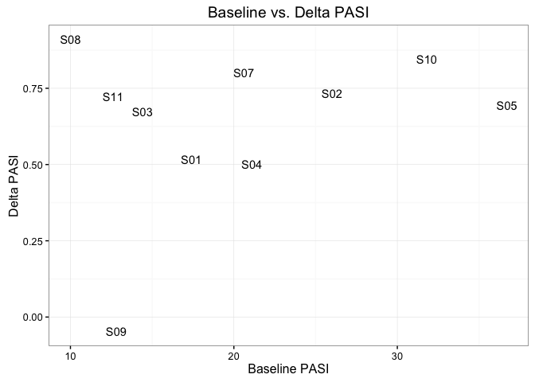
</p>

We find here that subject 9, the only patient who got worse over the course of treatment, is an outlier. Their delta PASI score singlehandedly creates the impression of a relationship between baseline and outcome statistics.

``` r
cor(df$PASI_wk00, df$DeltaPASI)
```

    ## [1] 0.2612898

``` r
cor(df$PASI_wk00[df$Subject != 'S09'], df$DeltaPASI[df$Subject != 'S09'])
```

    ## [1] -0.007712975

Early attempts at this analysis found that subject 9 was driving differential expression results due to the patient's high leverage in least squares regression modeling. Rather than remove this patient altogether, we Winsorise the distribution, replacing subject 9's delta PASI score with a lower limit defined as two median absolute deviations below the median of all delta PASI scores.

``` r
# Create function
winsorise <- function(x, multiple = 2) {
  y <- x - median(x)
  lim <- mad(y, center = 0) * multiple
  y[y > lim] <- lim
  y[y < -lim] <- -lim
  y <- y + median(x)
  return(y)
}

# Check to see which patient outcomes are changed by winsorisation
df <- pheno %>%
  distinct(Subject, DeltaPASI) %>%
  mutate(Winsorised = winsorise(DeltaPASI)) %>%
  data.table()

df
```

| Subject |   DeltaPASI|  Winsorised|
|:--------|-----------:|-----------:|
| S01     |   0.5172414|   0.5172414|
| S02     |   0.7346154|   0.7346154|
| S03     |   0.6736111|   0.6736111|
| S04     |   0.5023697|   0.5023697|
| S05     |   0.6948229|   0.6948229|
| S07     |   0.8009709|   0.8009709|
| S08     |   0.9100000|   0.9100000|
| S09     |  -0.0468750|   0.3677652|
| S10     |   0.8459120|   0.8459120|
| S11     |   0.7222222|   0.7222222|

This confirms that only subject 9 meets our winsorisation threshold. We can now change the data prior to modeling.

``` r
pheno[Subject == 'S09', DeltaPASI := df[Subject == 'S09', Winsorised]]
```

Exploratory Data Analysis
=========================

All EDA is conducted on the log CPM scale of the normalised count matrix.

``` r
mat <- cpm(y, log = TRUE)
colnames(mat) <- pheno$Sample
```

Mean-Variance Trend
-------------------

We begin by examining the data's mean-variance trend, as the shape of this curve is essential for the `voom` weights we intend to apply before testing for differential expression.

``` r
plot_mean_var(mat, type = 'RNA-seq')
```

<p align='center'>
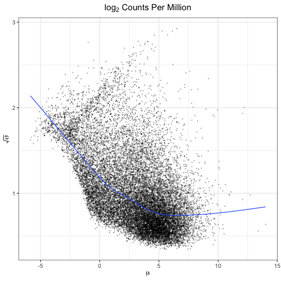
</p>

This plot looks about right for these data.

Density Plot
------------

While a mean-variance plot tells us something about the distribution of counts by gene, a density plot helps visualise the distribution of counts by sample. I've chosen to colour the densities by tissue type, since this is evidently the greatest source of variation in the data.

``` r
plot_density(mat, group = pheno$Tissue, type = 'RNA-seq')
```

<p align='center'>
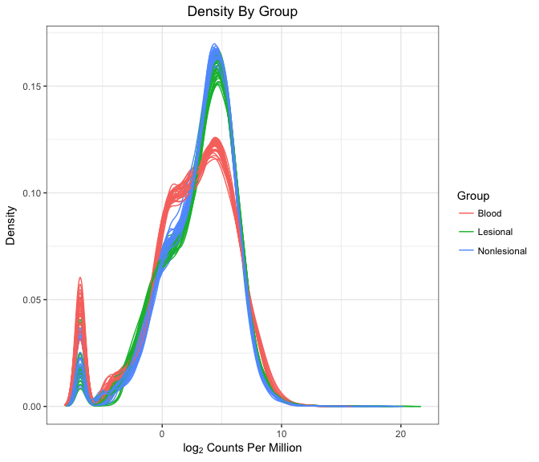
</p>

We find here that blood samples take a unique shape, while skin samples are generally more alike. Still, nonlesional tissue appears to have a slightly higher peak than lesional tissue. There are no clear outliers in this figure, but we cannot make a conclusive judgment about this without further exploration.

Sample Similarity Matrix
------------------------

We build a sample similarity matrix by calculating the pairwise Euclidean distance between all samples in the data. This matrix is then visualised as a heatmap and used to generate a hierarchical clustering dendrogram.

``` r
plot_sim_mat(mat, group = pheno$Tissue)
```

<p align='center'>
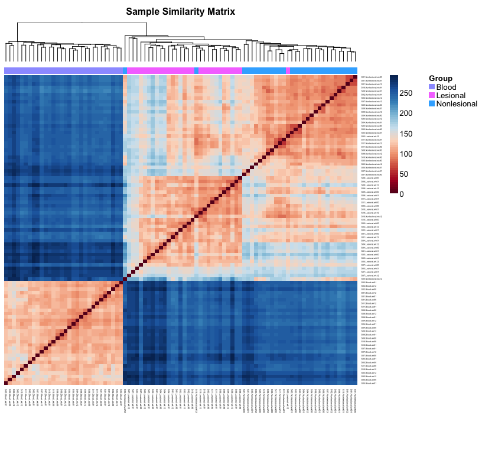
</p>

The dendrogram has perfectly separated blood from skin samples, although three from the latter group are misclassified between lesional and nonlesional tissue. Interestingly, each of these misclassifications comes from week 12, which suggests that positive response to treatment for these patients may have clouded the genetic distinction between lesional and nonlesional tissue over the course of the study.

Principle Component Analysis
----------------------------

One final, popular method for visualising the variance of a high-dimensional dataset along just two axes is principle component analysis (PCA).

``` r
plot_pca(mat, group = pheno$Tissue)
```

<p align='center'>
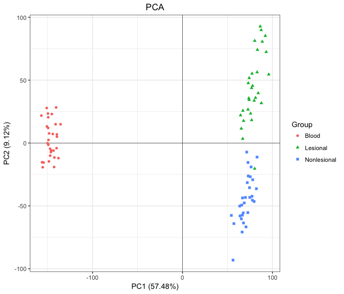
</p>

This plot represents perhaps the clearest possible summary of the findings from the last few figures. The first principle component, which captures nearly 60% of the variance in these data, perfectly separates blood from skin samples. The second principle component, which accounts for a little over 9% of the data variance, separates lesional from nonlesional tissue, albeit with some slight overlap at the fringes.

Models
======

We use different models to examine between- and within-subject variation across tissue types and time points by biologic response. We begin with between-subject comparisons, which examine differences at particular tissue-times.

Differences Across Subjects
---------------------------

### Design Matrix

``` r
# Build design matrix
des <- model.matrix(~ 0 + Tissue:Time + Tissue:Time:DeltaPASI, data = pheno)
colnames(des) <- c(paste(rep(unique(pheno$Time), times = 3), 
                         rep(unique(pheno$Tissue), each = 3), sep = '.'),
                   paste(rep(unique(pheno$Time), times = 3),
                         rep(unique(pheno$Tissue), each = 3),
                         'Response', sep = '.'))
```

This design matrix has 18 columns. The first 9 represent every tissue-time combination, effectively providing intercepts for each of the 9 sub-models of which this model is composed. The latter 9 are three-way interactions between tissue type, time point, and delta PASI, which we use to measure drug response. The coefficients for these variables will represent the slopes of each linear sub-model. We rename these variables for more convenient reference later on.

### Sample Weights

With 89 samples in our study collected from different tissues at various times, it's distinctly possible that there's significant variation in quality across libraries. The authors of the `limma` package originally introduced an `arrayWeights` function for microarray data so users could empirically estimate sample weights to incorporate in heteroscedastic linear model fits ([Ritchie et al., 2006](http://bmcbioinformatics.biomedcentral.com/articles/10.1186/1471-2105-7-261)). Shortly after introducing the `voom` transformation, which allows RNA-seq count matrices to be modeled in the `limma` pipeline ([Law et al., 2014](https://genomebiology.biomedcentral.com/articles/10.1186/gb-2014-15-2-r29)), the package authors extended Ritchie et al.'s sample weighting procedure to RNA-seq data ([Liu et al., 2015](http://nar.oxfordjournals.org/content/early/2015/04/28/nar.gkv412.full)). We can check for variability in library quality by plotting the results of a preliminary estimation of `voom` sample weights.

``` r
# Estimate weights
v <- voomWithQualityWeights(y, des)

# Tidy data
df <- data_frame(Sample = paste0('S', 1:89),
                 Tissue = pheno$Tissue,
                 Weight = as.numeric(v$sample.weights)) %>%
  mutate(Sample = factor(Sample, levels = unique(Sample)))

# Plot results
ggplot(df, aes(Sample, Weight, fill = Tissue)) +
  geom_bar(stat = 'identity') + 
  geom_hline(yintercept = 1, linetype = 'dashed') + 
  labs(title = 'Library Quality by Tissue') + 
  theme_bw() + 
  theme(axis.text.x = element_text(angle = 45, hjust = 1)) + 
  theme(legend.justification = c(1, 1), legend.position = c(1, 1))
```

<p align='center'>
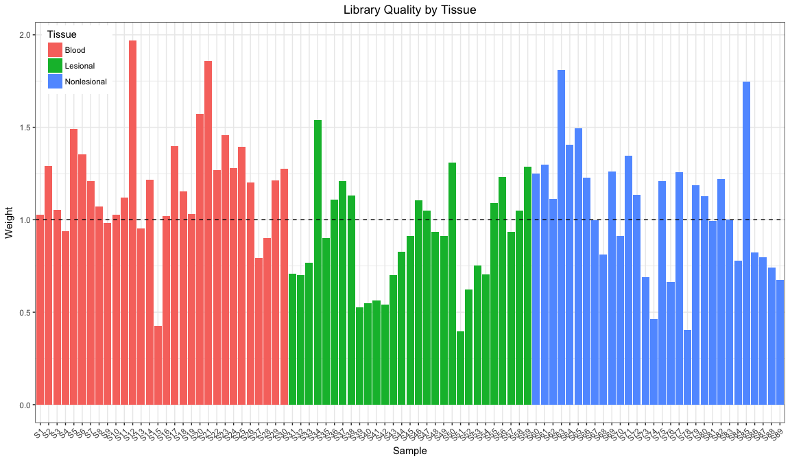
</p>

Library quality does seem to vary across samples, but it's not entirely clear whether that's a function of tissue, time, the interaction between them, or perhaps even subject. To find out, we run a series of *F*-tests. The first three are repeated measures ANOVAs, the latter a simple one-way ANOVA. (Technically, we should remove subject 11 from the repeated measures ANOVAs since this patient's week 12 lesional sample is NA; in practice, it makes no difference here.)

``` r
df <- df %>%
  mutate(Subject = pheno$Subject,
         Time    = pheno$Time)

# Do sample weights vary significantly by tissue?
anova(lm(Weight ~ Subject + Tissue, data = df),
      lm(Weight ~ Subject, data = df))
```

|  Res.Df|       RSS|   Df|  Sum of Sq|         F|  Pr(&gt;F)|
|-------:|---------:|----:|----------:|---------:|----------:|
|      77|  6.783010|   NA|         NA|        NA|         NA|
|      79|  8.130009|   -2|  -1.346999|  7.645491|   0.000936|

``` r
# By time?
anova(lm(Weight ~ Subject + Time, data = df),
      lm(Weight ~ Subject, data = df))
```

|  Res.Df|       RSS|   Df|   Sum of Sq|         F|  Pr(&gt;F)|
|-------:|---------:|----:|-----------:|---------:|----------:|
|      77|  7.903951|   NA|          NA|        NA|         NA|
|      79|  8.130009|   -2|  -0.2260577|  1.101123|  0.3376754|

``` r
# By tissue-time?
anova(lm(Weight ~ Subject + Tissue:Time, data = df),
      lm(Weight ~ Subject, data = df))
```

|  Res.Df|       RSS|   Df|  Sum of Sq|        F|  Pr(&gt;F)|
|-------:|---------:|----:|----------:|--------:|----------:|
|      71|  6.202758|   NA|         NA|       NA|         NA|
|      79|  8.130009|   -8|  -1.927251|  2.75754|  0.0103565|

``` r
# By subject?
anova(lm(Weight ~ Subject, data = df),
      lm(Weight ~ 1, data = df))
```

|  Res.Df|       RSS|   Df|  Sum of Sq|         F|  Pr(&gt;F)|
|-------:|---------:|----:|----------:|---------:|----------:|
|      79|  8.130009|   NA|         NA|        NA|         NA|
|      88|  9.483797|   -9|  -1.353788|  1.461653|  0.1769499|

It appears from these *F*-tests that tissue type is the main driver of variation in library quality. This is true even though the design matrix passed to `voomWithQualityWeights` includes a Tissue:Time interaction term, meaning residual sample variance is only calculated in comparison to other libraries from the same tissue-time. Because the variability is considerable - the minimum and maximum weights differ by a factor of five - we elect to build a heteroscedastic model that will take sample weights into account.

### Random Effect

To account for the intra-subject correlations inherent to our study's repeated measures design, we use the `duplicateCorrelation` function. This approximates a mixed model in which a blocking variable, in this case the interaction between subject and tissue type, becomes a random effect ([Smyth, 2005](http://www.statsci.org/smyth/pubs/dupcor.pdf)). Following the [advice of the package authors](https://support.bioconductor.org/p/59700/), we estimate `voom` weights and block correlations twice each. We also store the model's vector of Ensembl IDs for later reference.

``` r
corfit <- duplicateCorrelation(v, des, block = pheno$Subject.Tissue)
v <- voomWithQualityWeights(y, des, 
                            correlation = corfit$consensus, block = pheno$Subject.Tissue)
corfit <- duplicateCorrelation(v, des, block = pheno$Subject.Tissue)
idx <- rownames(v)
```

It's worth checking to see how high the intra-block correlation is just to confirm it's a positive real number on (0, 1).

``` r
corfit$consensus
```

    ## [1] 0.320959

That value seems plausible, and confirms that we are right to use this approach. The positive correlation of expression values within each subject-tissue violates the assumption of independence upon which fixed effect models are based.

### Genewise Regressions

With all these pieces in place, all that's left to do is fit the genewise regressions. We write a custom function to export results, which modifies `limma`'s default `topTable` output by replacing the classic [Benjamini-Hochberg FDR](https://www.jstor.org/stable/2346101) with [Storey's *q*-values](http://people.eecs.berkeley.edu/~jordan/sail/readings/storey-annals-05.pdf), offering greater power for measuring [genomewide significance](http://www.pnas.org/content/100/16/9440.full). We also rename and reshuffle columns for a clean, consistent output.

``` r
res <- function(contrast) {
  topTable(fit, number = Inf, sort.by = 'none',
           coef = contrast) %>%
    mutate(q.value = qvalue(P.Value)$qvalues, 
           gene_id = idx) %>%
    inner_join(e2g, by = 'gene_id') %>%
    rename(EnsemblID  = gene_id,
           GeneSymbol = gene_name,
           p.value    = P.Value, 
           AvgExpr    = AveExpr) %>%
    arrange(p.value) %>%
    select(EnsemblID, GeneSymbol, AvgExpr, logFC, p.value, q.value) %>%
    fwrite(paste0('./Results/Response/', 
                  paste0(contrast, '.txt')), sep = '\t')
}
```

We now fit the model and export results for each tissue-time contrast. We use a robust empirical Bayes shrinkage procedure to mitigate the impact of hypervariable genes ([Phipson et al., 2016](https://arxiv.org/abs/1602.08678)).

``` r
fit <- lmFit(v, des, correlation = corfit$consensus, block = pheno$Subject)
fit <- eBayes(fit, robust = TRUE)
for (i in colnames(des)[10:18]) res(i)
```

Difference Across Time Points
-----------------------------

The steps for between-subject comparisons are broadly similar, although in this case we include a Subject:Tissue interaction term to serve as a baseline for paired contrasts. Because this explicitly models the intra-block correlations in our data, we no longer need the `duplicateCorrelation` function to approximate a random effect.

``` r
des <- model.matrix(~ 0 + Subject:Tissue + Tissue:Time + Tissue:Time:DeltaPASI, 
                    data = pheno)
des <- des[, !grepl('wk00', colnames(des))]
colnames(des) <- c(paste(paste0('S', 1:10), 
                         rep(unique(pheno$Tissue), each = 10), sep = '.'),
                   paste(rep(unique(pheno$Tissue), times = 2),
                         rep(c('wk01', 'wk12'), each = 3), sep = '.'),
                   paste(rep(unique(pheno$Tissue), times = 2), 
                       rep(c('Delta01', 'Delta12'), each = 3), 
                       'Response', sep = '.'))
```

The idea here is to model the difference in expression between any two time points as a linear function of delta PASI. Towards that end, this design matrix has 42 columns. The first 30 pick up baseline expression for each subject-tissue. The next 6 represent the intercepts of linear sub-models representing the changes in each tissue type between baseline and weeks 1 and 12, respectively. The final 6 coefficients represent the slopes of each sub-model. Extracting results for these contrasts will inform us as to the change in expression associated with response in the first week of treatment, as well as across the full 12 weeks. We will build a contrast matrix to infer results about 11-week changes based on this parametrisation.

``` r
# Fit the model
v <- voomWithQualityWeights(y, des)
urFit <- lmFit(v, des)
fit <- eBayes(urFit, robust = TRUE)

# Export results for 1 and 12 week changes
for (i in colnames(des)[37:42]) res(i)

# Build contrast matrix to extract results for 11 week changes
cm <- makeContrasts('Blood.Delta11.Response' = 
                      Blood.Delta12.Response - Blood.Delta01.Response,
                    'Lesional.Delta11.Response' = 
                      Lesional.Delta12.Response - Lesional.Delta01.Response,
                    'Nonlesional.Delta11.Response' = 
                      Nonlesional.Delta12.Response - Nonlesional.Delta01.Response,
                    levels = des)
fit <- eBayes(contrasts.fit(urFit, cm), robust = TRUE)
for (i in colnames(cm)) res(i)
```

Differential Expression Analysis
================================

To get an overview of how many genes are declared differentially expressed across all our contrasts at 10% FDR, we build the following summary table.

``` r
# Create grid
df <- expand.grid(Tissue  = c('Blood', 'Lesional', 'Nonlesional'),
                  Time    = c('wk00', 'wk01', 'wk12', 
                             'Delta01', 'Delta11', 'Delta12'),
                  DEgenes = NA)

# Populate DEgenes column
for (i in 1:nrow(df)) {
  df$DEgenes[i] <- fread(paste0('./Results/Response/',
                         paste(df[i, 1], df[i, 2], 'Response.txt', sep = '.'))) %>%
                     summarise(sum(q.value < 0.1)) %>%
                     as.numeric()
}

# Check table
df
```

| Tissue      | Time    |  DEgenes|
|:------------|:--------|--------:|
| Blood       | wk00    |        8|
| Lesional    | wk00    |       25|
| Nonlesional | wk00    |       46|
| Blood       | wk01    |        2|
| Lesional    | wk01    |       15|
| Nonlesional | wk01    |        9|
| Blood       | wk12    |       12|
| Lesional    | wk12    |      118|
| Nonlesional | wk12    |        8|
| Blood       | Delta01 |        9|
| Lesional    | Delta01 |        1|
| Nonlesional | Delta01 |       18|
| Blood       | Delta11 |        0|
| Lesional    | Delta11 |        7|
| Nonlesional | Delta11 |        3|
| Blood       | Delta12 |        2|
| Lesional    | Delta12 |        2|
| Nonlesional | Delta12 |        2|

It appears there are signs of differential expression in some tissue-time combinations, but less so across time points. To get a better sense for these results, it helps to visualise them as a bar plot.

``` r
ggplot(df, aes(Time, DEgenes, fill = Tissue)) + 
  geom_bar(stat = 'identity', position = 'dodge') + 
  labs(title = 'Differential Expression by Tissue and Time',
       y = 'Differentially Expressed Genes (10% FDR)') + 
  theme_bw() + 
  theme(legend.justification = c(1, 1), legend.position = c(1, 1))
```

<p align='center'>
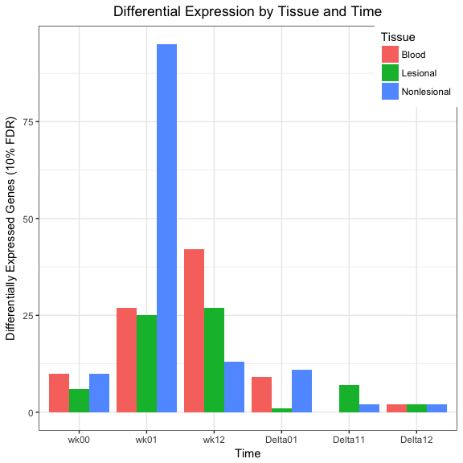
</p>

The single most differentially expressed contrast in these data is lesional skin at week 12, which makes good biological sense. No tissue type is especially predictive of response at baseline, although nonlesional skin seems to have the clearest signal of the three.

Nonlesional Skin, Baseline
--------------------------

Let's take a closer look at the baseline results for nonlesional skin. These are the top ten genes associated with biologic response in that contrast.

``` r
top <- fread('./Results/Response/Nonlesional.wk00.Response.txt')
head(top, 10)
```

| EnsemblID       | GeneSymbol   |     AvgExpr|      logFC|  p.value|    q.value|
|:----------------|:-------------|-----------:|----------:|--------:|----------:|
| ENSG00000123219 | CENPK        |   2.9594993|  -3.295766|  0.0e+00|  0.0000451|
| ENSG00000261349 | RP3-465N24.5 |  -1.6165846|  11.910650|  0.0e+00|  0.0001232|
| ENSG00000064655 | EYA2         |  -0.0150056|  13.190668|  1.0e-07|  0.0004760|
| ENSG00000196090 | PTPRT        |   0.2866142|  17.513648|  2.0e-07|  0.0009352|
| ENSG00000234218 | MICB         |  -3.9957524|  20.579315|  3.0e-07|  0.0013489|
| ENSG00000224859 | ZNRD1        |  -2.8749890|  23.564307|  1.0e-06|  0.0032133|
| ENSG00000079691 | LRRC16A      |   4.7874031|  -1.976279|  1.7e-06|  0.0048054|
| ENSG00000197728 | RPS26        |   6.6909155|   3.934162|  2.3e-06|  0.0056265|
| ENSG00000155970 | MICU3        |   3.0533648|  -2.805703|  2.8e-06|  0.0059221|
| ENSG00000117597 | DIEXF        |   4.8641665|  -1.191426|  3.8e-06|  0.0068090|

It will be interesting to see if pathway analysis confirms a strong TNF inhibitor signal in these data.

Let's quickly check that *p*-values are well-behaved.

``` r
qq(top$p.value, pch = 16, cex = 0.3, main = 'QQ Plot: \n Lesional Skin, Baseline')
```

<p align='center'>
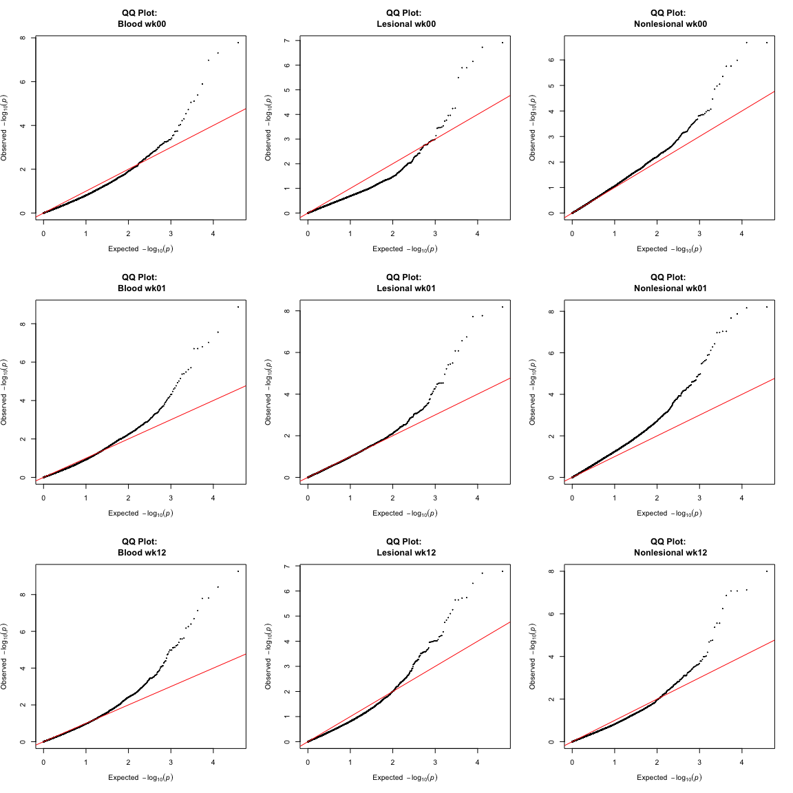
</p>

The observed *p*-values begin to deviate from their expected distribution under the null hypothesis quite early in this plot, suggesting that there may be a considerable number of false negatives in these results and/or some covariance structure in the data that has not been adequately captured by our model.

Next, we visualise the mean-variance trend in these results with an MD plot.

``` r
plot_md(top, fdr = 0.1, 
        main = 'Differential Expression by Drug Response: \n Lesional Skin, Baseline')
```

<p align='center'>
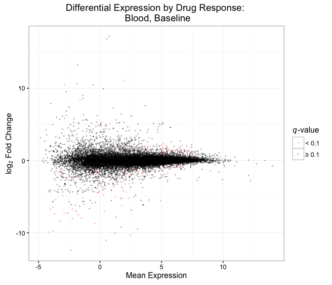
</p>

This figure looks reasonable, although it appears there may be more up-regulation than down-regulation in this contrast. A volcano plot will help test this assumption.

``` r
plot_volcano(top, fdr = 0.1, 
             main = 'Differential Expression by Drug Response: \n Lesional Skin, Baseline')
```

<p align='center'>
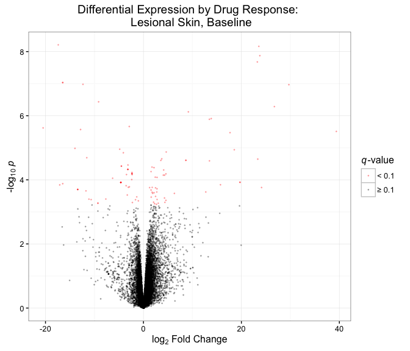
</p>

The plot is a little right-shifted, indicating more up- than down-regulation among genes in this contrast, but the difference is not particularly extreme.

A heatmap provides another visual tool with which to explore these results.

``` r
# Define colour palette
rb <- colorRampPalette(brewer.pal(10, 'RdBu'))(n = 256)

# Create DE gene matrix
mat <- as.data.frame(mat) %>%
  mutate(EnsemblID = idx) %>%
  inner_join(top, by = 'EnsemblID') %>%
  filter(q.value <= 0.1) %>%
  select(grep('Nonlesional.wk00', colnames(mat)),
         GeneSymbol)
deg <- mat %>%
  select(-GeneSymbol) %>%
  as.matrix()
rownames(deg) <- mat$GeneSymbol
colnames(deg) <- gsub('.Nonlesional.wk00', '', colnames(deg))

# Plot heatmap
aheatmap(deg, distfun = 'pearson', scale = 'row', col = rb,
         main = paste0('Differentially Expressed Genes, 10% FDR \n Lesional Skin, Baseline'),
         annCol = list(DeltaPASI = pheno$DeltaPASI[grep('Nonlesional.wk00', pheno$Sample)]))
```

<p align='center'>
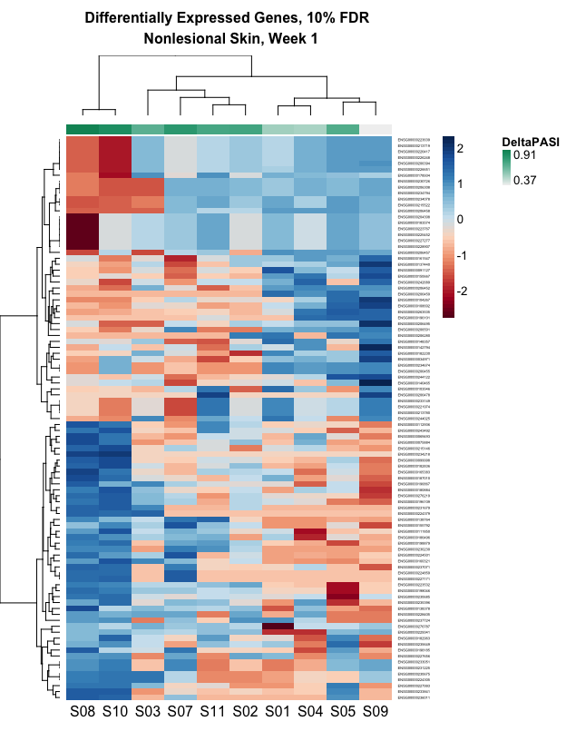
</p>

The sample-wise clustering in this heatmap makes some sense. Patients are seemingly stratified into strong, medium, and non-responders. The gene-wise clustering, however, is a little harder to parse out. Expression values for each gene vary considerably across libraries, with only a few instances of clear blocks emerging from the data. That could be a byproduct of the relatively low dimensionality in this case - just 46 genes observed across 10 samples. We'll continue with bigger matrices in later analyses.
