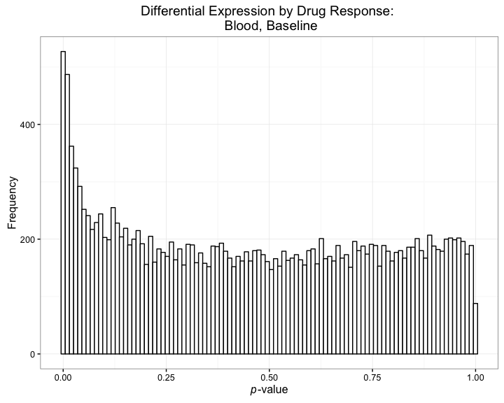

Differential Expression by Biologic Response
================

-   [Import Data](#import-data)
-   [Preprocessing](#preprocessing)
-   [Exploratory Data Analysis](#exploratory-data-analysis)
-   [Model Fit](#model-fit)
-   [Differential Expression Analysis](#differential-expression-analysis)

All analysis was conducted in R version 3.3.1 using the following script. Computations were performed on a MacBook Pro with 16GB of RAM.

If you haven't already installed the `bioplotr` package, you'll need to do so to reproduce some of the figures below.

``` r
# Install bioplotr
devtools::install_github('dswatson/bioplotr')

# Load libraries
library(bioplotr)
library(data.table)
library(tximport)
library(edgeR)
library(limma)
library(qvalue)
library(qqman)
library(RColorBrewer)
library(NMF)
library(tidyverse)
```

Import Data
===========

Following RNA-seqencing of all samples, reads were pseudo-aligned using kallisto ([Bray et al., 2016](http://www.nature.com/nbt/journal/v34/n5/full/nbt.3519.html)). Our reference genome was [GRCh38.p2](http://mar2015.archive.ensembl.org/Homo_sapiens/Info/Index), Ensembl version 79. Transcript-level reads were aggregated to gene-level using the `tximport` package ([Soneson et al., 2015](https://f1000research.com/articles/4-1521/v2)).

``` r
# Load data
pheno <- fread('./Data/Clinical.csv')
t2g <- fread('./Data/Ensembl.Hs79.Tx.csv')
files <- file.path('./Data/RawCounts', pheno$Sample, 'abundance.tsv')
txi <- tximport(files, type = 'kallisto', tx2gene = t2g, reader = fread, 
                countsFromAbundance = 'lengthScaledTPM')
```

Preprocessing
=============

Before conducting EDA or differential expression analysis, we remove genes with less than one count per million (CPM) in at least nine libraries. This ensures that every gene is expressed in at least one of our nine replicates per subject (three tissue types observed at three timepoints each). This threshold follows the filtering guidelines of [Robinson et al. (2010)](https://www.ncbi.nlm.nih.gov/pubmed/19910308). Counts are then TMM normalised prior to modeling ([Robinson & Oshlack, 2010](https://genomebiology.biomedcentral.com/articles/10.1186/gb-2010-11-3-r25)). See the extensive `edgeR` [package vignette](https://www.bioconductor.org/packages/3.3/bioc/vignettes/edgeR/inst/doc/edgeRUsersGuide.pdf) for more details.

``` r
# Filter genes
keep <- rowSums(cpm(txi$counts) > 1) >= 9
y <- DGEList(txi$counts[keep, ])
y <- calcNormFactors(y)
```

Exploratory Data Analysis
=========================

All EDA is conducted on the log CPM scale of the normalised count matrix.

``` r
mat <- cpm(y, log = TRUE)
colnames(mat) <- pheno$Sample
```

Mean-Variance Trend
-------------------

We begin by examining the data's mean-variance trend, as the shape of this curve is essential for the `voom` weights we intend to apply before testing for differential expression.

``` r
plot_mean_var(mat, type = 'RNA-seq')
```


This plot looks about right for these data.

Density Plot
------------

While a mean-variance plot tells us something about the distribution of counts by gene, a density plot helps visualise the distribution of counts by sample. I've chosen to colour the densities by tissue type, since this is evidently the greatest source of variation in the data.

``` r
plot_density(mat, group = pheno$Tissue, type = 'RNA-seq')
```


We find here that blood samples take a unique shape, while skin samples are generally more alike. Still, nonlesional tissue appears to have a slightly higher peak than lesional tissue. There are no clear outliers in this figure, but we cannot make a conclusive judgment about this without further exploration.

Sample Similarity Matrix
------------------------

We build a sample similarity matrix by calculating the pairwise Euclidean distance between all samples in the data. This matrix is then visualised as a heatmap and used to generate a hierarchical clustering dendrogram.

``` r
plot_sim_mat(mat, group = pheno$Tissue)
```


The dendrogram has perfectly separated blood from skin samples, although four from the latter group are misclassified between lesional and nonlesional tissue. Interestingly, each of these misclassifications comes from week 12, which suggests that positive response to treatment for these patients may have clouded the genetic distinction between lesional and nonlesional tissue over the course of the study.

Principle Component Analysis
----------------------------

One final, popular method for visualising the variance of a high-dimensional dataset along just two axes is principle component analysis (PCA).

``` r
plot_pca(mat, group = pheno$Tissue)
```


This plot represents perhaps the clearest possible summary of the findings from the last few figures. The first principle component, which captures nearly 60% of the variance in these data, perfectly separates blood from skin samples. The second principle component, which accounts for a little over 9% of the data variance, separates lesional from nonlesional tissue, albeit with some overlap at the fringes.

Model Fit
=========

Our study's repeated measures design requires a mixed modeling approach in order to examine between- and within-subject variation using a single model. Toward that end, we proceed in the following stages.

Design Matrix
-------------

``` r
# Build design matrix
des <- model.matrix(~ 0 + Time:Tissue + Time:Tissue:DeltaPASI, data = pheno)
colnames(des)[10:18] <- c(paste(rep(unique(pheno$Time), each = 3), 
                                unique(pheno$Tissue), 
                                'Response', sep = '.'))
```

This design matrix has 18 columns. The first nine represent every tissue-time point combination, effectively providing intercepts for each of the nine sub-models of which this study is composed. The latter nine are three-way interactions between tissue type, time point, and delta PASI, which we use to measure drug response. The coefficients for these variables will represent the slopes of each linear sub-model. We rename these variables for more convenient reference later on.

Sample Weights
--------------

With 89 samples in our study collected from different tissues at various times, it's distinctly possible that there's significant variation in quality across libraries. The authors of the `limma` package originally introduced an `arrayWeights` function for microarray data so users could empirically estimate sample weights to incorporate in heteroscedastic linear model fits ([Ritchie et al., 2006](http://bmcbioinformatics.biomedcentral.com/articles/10.1186/1471-2105-7-261)). Shortly after introducing the `voom` transformation, which allows RNA-seq count matrices to be modeled in the `limma` pipeline ([Law et al., 2014](https://genomebiology.biomedcentral.com/articles/10.1186/gb-2014-15-2-r29)), the package authors extended Ritchie et al.'s sample weighting procedure to RNA-seq data ([Liu et al., 2015](http://nar.oxfordjournals.org/content/early/2015/04/28/nar.gkv412.full)). We can check for variability in library quality by plotting the results of a preliminary estimation of `voom` sample weights.

``` r
# Estimate weights
v <- voomWithQualityWeights(y, des)

# Tidy data
df <- data_frame(Sample = paste0('S', 1:89),
                 Tissue = pheno$Tissue,
                 Weight = as.numeric(v$sample.weights)) %>%
  mutate(Sample = factor(Sample, levels = unique(Sample)))

# Plot results
ggplot(df, aes(Sample, Weight, fill = Tissue)) +
  geom_bar(stat = 'identity') + 
  geom_hline(yintercept = 1, linetype = 'dashed') + 
  labs(title = 'Library Quality by Tissue') + 
  theme_bw() + 
  theme(axis.text.x = element_text(angle = 45, hjust = 1)) + 
  theme(legend.justification = c(1, 1), legend.position = c(1, 1))
```


Library quality does seem to vary across samples, but it's not entirely clear whether that's a function of tissue, time, the interaction between them, or perhaps even subject. To find out, we run a series of F-tests. The first three are repeated measures ANOVAs, the latter a simple one-way ANOVA. (Technically, we should remove subject 11 from the repeated measures ANOVAs since this patient's week 12 nonlesional sample is NA; in practice, it makes no difference here.)

``` r
df <- df %>%
  mutate(Subject = pheno$Subject,
         Time    = pheno$Time)

# Do sample weights vary significantly by time point?
anova(lm(Weight ~ Subject + Time, data = df),
      lm(Weight ~ Subject, data = df))
```

|  Res.Df|       RSS|   Df|   Sum of Sq|         F|  Pr(&gt;F)|
|-------:|---------:|----:|-----------:|---------:|----------:|
|      77|  8.241848|   NA|          NA|        NA|         NA|
|      79|  8.543687|   -2|  -0.3018389|  1.409975|  0.2503815|

``` r
# By tissue type?
anova(lm(Weight ~ Subject + Tissue, data = df),
      lm(Weight ~ Subject, data = df))
```

|  Res.Df|       RSS|   Df|  Sum of Sq|         F|  Pr(&gt;F)|
|-------:|---------:|----:|----------:|---------:|----------:|
|      77|  7.043847|   NA|         NA|        NA|         NA|
|      79|  8.543687|   -2|   -1.49984|  8.197772|   0.000592|

``` r
# By time/tissue combination?
anova(lm(Weight ~ Subject + Time:Tissue, data = df),
      lm(Weight ~ Subject, data = df))
```

|  Res.Df|       RSS|   Df|  Sum of Sq|         F|  Pr(&gt;F)|
|-------:|---------:|----:|----------:|---------:|----------:|
|      71|  6.405184|   NA|         NA|        NA|         NA|
|      79|  8.543687|   -8|  -2.138502|  2.963101|  0.0064209|

``` r
# By subject?
anova(lm(Weight ~ Subject, data = df),
      lm(Weight ~ 1, data = df))
```

|  Res.Df|        RSS|   Df|  Sum of Sq|         F|  Pr(&gt;F)|
|-------:|----------:|----:|----------:|---------:|----------:|
|      79|   8.543687|   NA|         NA|        NA|         NA|
|      88|  10.032019|   -9|  -1.488332|  1.529112|  0.1522644|

It appears from these F-tests that tissue type is the main driver of variation in library quality. This is true even though the design matrix passed to `voomWithQualityWeights` includes a Time:Tissue interaction term, meaning sample variance is only calculated in comparison to other libraries from the same Time:Tissue combination. Because the variability is considerable - the minimum and maximum weights differ by a factor of five - we elect to build a heteroscedastic model that will take sample weights into account.

Random Effect
-------------

As noted above, our study requires that we look for differential expression both between patients (i.e., at various tissue-times) and within patients (i.e., across time points). To account for the intra-subject correlations inherent to this repeated measures design, we use the `duplicateCorrelation` function to approximate a mixed model in which the subject blocking variable becomes a random effect ([Smyth, 2005](http://www.statsci.org/smyth/pubs/dupcor.pdf)). Following the [advice of the package authors](https://support.bioconductor.org/p/59700/), we estimate `voom` weights and block correlations twice each.

``` r
corfit <- duplicateCorrelation(v, des, block = pheno$Subject)
v <- voomWithQualityWeights(y, des, 
                            correlation = corfit$consensus, block = pheno$Subject)
corfit <- duplicateCorrelation(v, des, block = pheno$Subject)
```

It's worth checking to see how high the intra-subject correlation is just to confirm it's a real positive number on (0, 1).

``` r
corfit$consensus
```

    ## [1] 0.1658636

That seems plausible.

Genewise Regressions
--------------------

With all these pieces in place, all that's left to do is fit the genewise regressions. Since we'll need to perform empirical Bayes shrinkage separately on between- and within-block contrasts, we save the `MArrayLM` object as `urFit` and store the vector of Ensembl IDs for later reference.

``` r
# Fit model
urFit <- lmFit(v, des, correlation = corfit$consensus, block = pheno$Subject)

# Get Ensembl IDs
idx <- rownames(v)
```

Differential Expression Analysis
================================

We now export the results of each contrast with the following code, which modifies `limma`'s default `topTable` output by replacing the classic [Benjamini-Hochberg FDR](https://www.jstor.org/stable/2346101) with [Storey's *q*-values](http://people.eecs.berkeley.edu/~jordan/sail/readings/storey-annals-05.pdf), offering greater power for measuring [genomewide significance](http://www.pnas.org/content/100/16/9440.full). We also rename/reshuffle columns for a clean, consistent output.

``` r
# At time
fit <- eBayes(urFit)
for (tissue in unique(pheno$Tissue))  {
  for (time in unique(pheno$Time)) {
    topTable(fit, number = Inf, sort.by = 'none',
             coef = paste(time, tissue, 'Response', sep = '.')) %>%
      mutate(q.value = qvalue(P.Value)$qvalues, 
             gene_id = idx) %>%
      inner_join(e2g, by = 'gene_id') %>%
      rename(EnsemblID  = gene_id,
             GeneSymbol = gene_name,
             p.value    = P.Value, 
             AvgExpr    = AveExpr) %>%
      arrange(p.value) %>%
      select(EnsemblID, GeneSymbol, AvgExpr, logFC, p.value, q.value) %>%
      fwrite(paste0('./Results/Response/', 
                    paste(tissue, time, 'txt', sep = '.')), sep = '\t')
  }
}
  
# Over time
cm <- makeContrasts('Blood.Delta01' = wk01.Blood.Response - wk00.Blood.Response,
                    'Blood.Delta11' = wk12.Blood.Response - wk01.Blood.Response,
                    'Blood.Delta12' = wk12.Blood.Response - wk00.Blood.Response, 
                    'Lesional.Delta01' = wk01.Lesional.Response - wk00.Lesional.Response,
                    'Lesional.Delta11' = wk12.Lesional.Response - wk01.Lesional.Response,
                    'Lesional.Delta12' = wk12.Lesional.Response - wk00.Lesional.Response,
                    'Nonlesional.Delta01' = wk01.Nonlesional.Response - wk00.Nonlesional.Response,
                    'Nonlesional.Delta11' = wk12.Nonlesional.Response - wk01.Nonlesional.Response,
                    'Nonlesional.Delta12' = wk12.Nonlesional.Response - wk00.Nonlesional.Response, 
                    levels = des)
fit <- eBayes(contrasts.fit(urFit, cm))
for (tissue in unique(pheno$Tissue))  {
  for (delta in c('Delta01', 'Delta11', 'Delta12')) {
    topTable(fit, number = Inf, sort.by = 'none',
             coef = paste(tissue, delta, sep = '.')) %>%
      mutate(q.value = qvalue(P.Value)$qvalues, 
             gene_id = idx) %>%
      inner_join(e2g, by = 'gene_id') %>%
      rename(EnsemblID  = gene_id,
             GeneSymbol = gene_name,
             p.value    = P.Value, 
             AvgExpr    = AveExpr) %>%
      arrange(p.value) %>%
      select(EnsemblID, GeneSymbol, AvgExpr, logFC, p.value, q.value) %>%
      fwrite(paste0('./Results/Response/', 
                    paste(tissue, delta, 'txt', sep = '.')), sep = '\t')
  }
}
```

To get an overview of how many genes are declared differentially expressed at 10% FDR, we build the following summary table.

``` r
# Create grid
df <- expand.grid(Tissue  = c('Blood', 'Lesional', 'Nonlesional'),
                  Time    = c('wk00', 'wk01', 'wk12', 
                             'Delta01', 'Delta11', 'Delta12'),
                  DEgenes = NA)

# Populate DEgenes column
for (i in 1:nrow(df)) {
  df$DEgenes[i] <- fread(paste0('./Results/Response/',
                         paste(df[i, 1], df[i, 2], 'txt', sep = '.'))) %>%
                     summarise(sum(q.value < 0.1)) %>%
                     as.numeric()
}

# Check table
df
```

| Tissue      | Time    |  DEgenes|
|:------------|:--------|--------:|
| Blood       | wk00    |       39|
| Lesional    | wk00    |       10|
| Nonlesional | wk00    |       14|
| Blood       | wk01    |      204|
| Lesional    | wk01    |       85|
| Nonlesional | wk01    |       41|
| Blood       | wk12    |       28|
| Lesional    | wk12    |       24|
| Nonlesional | wk12    |        6|
| Blood       | Delta01 |        1|
| Lesional    | Delta01 |        0|
| Nonlesional | Delta01 |        0|
| Blood       | Delta11 |        3|
| Lesional    | Delta11 |        2|
| Nonlesional | Delta11 |        0|
| Blood       | Delta12 |        3|
| Lesional    | Delta12 |        0|
| Nonlesional | Delta12 |        0|

It appears there are signs of differential expression in some tissue-time combinations, but almost none in the cross time point comparisons. To get a better sense for these results, it helps to visualise them as a bar plot.

``` r
ggplot(df, aes(Time, DEgenes, fill = Tissue)) + 
  geom_bar(stat = 'identity', position = 'dodge') + 
  labs(title = 'Differential Expression by Tissue and Time',
       y = 'Differentially Expressed Genes (10% FDR)') + 
  theme_bw() + 
  theme(legend.justification = c(1, 1), legend.position = c(1, 1))
```


The single most differentially expressed contrast in these data is lesional skin at week 12, which makes good biological sense. Somewhat more surprising is the strong signal in blood at baseline and one week into treatment.

Blood, Baseline
---------------

Let's take a closer look at the baseline blood results. These are the top ten genes associated with biologic response in that contrast.

``` r
top <- fread('./Results/Response/Blood.wk00.txt')
head(top, 10)
```

| EnsemblID       | GeneSymbol   |     AvgExpr|       logFC|  p.value|    q.value|
|:----------------|:-------------|-----------:|-----------:|--------:|----------:|
| ENSG00000241910 | HLA-DOB      |  -4.1884043|   -9.712727|  0.0e+00|  0.0000000|
| ENSG00000206486 | DHX16        |  -0.6383182|   -5.788686|  0.0e+00|  0.0000012|
| ENSG00000206495 | TRIM39       |  -3.2298649|   -8.320310|  0.0e+00|  0.0000012|
| ENSG00000206502 | ZNRD1        |  -3.8217246|   -9.615051|  0.0e+00|  0.0000028|
| ENSG00000206505 | HLA-A        |   2.4655759|   -9.763968|  0.0e+00|  0.0000029|
| ENSG00000237599 | TAP2         |  -2.3685942|  -12.023545|  0.0e+00|  0.0001151|
| ENSG00000177051 | FBXO46       |   3.2609698|   -2.073065|  3.2e-06|  0.0087825|
| ENSG00000261349 | RP3-465N24.5 |  -1.6165846|    8.369806|  4.4e-06|  0.0107155|
| ENSG00000233418 | DHX16        |   2.4392871|    1.272198|  8.9e-06|  0.0157309|
| ENSG00000233561 | DHX16        |   2.4392871|    1.272198|  8.9e-06|  0.0157309|

It will be interesting to see if pathway analysis confirms a strong TNF inhibitor signal in these data.

Let's quickly check that *p*-values are well-behaved.

``` r
ggplot(top, aes(p.value)) + 
  geom_histogram(bins = 100, colour = 'black', fill = 'white') + 
  labs(title = 'Differential Expression by Drug Response: \n Blood, Baseline',
       x = expression(italic(p)*'-value'),
       y = 'Frequency') + 
  theme_bw()
```



Those look about right. Let's confirm with a qq-plot.

``` r
qq(top$p.value)
```


The observed *p*-values begin to deviate from their expected distribution under the null hypothesis quite early in the plot, suggesting that there may be a considerable number of false negatives in these results. A larger study will likely detect far more differentially expressed genes in blood at baseline. Interestingly, when we only looked at between-subject contrasts using `DESeq2` and surrogate variables ([Leek, 2014](http://nar.oxfordjournals.org/content/early/2014/10/07/nar.gku864)), we found several hundred more genes passing 5% FDR in this contrast. This is consistent with claims by proponents of both packages that they boost power to detect differential expression ([Love et al., 2014](https://www.ncbi.nlm.nih.gov/pubmed/25516281); [Leek & Storey, 2007](http://journals.plos.org/plosgenetics/article?id=10.1371/journal.pgen.0030161)). Unfortunately, `DESeq2` has no way of including random effects for longitudinal comparisons. SVA could potentially be run on a mixed model design by including the random effect in the complete design matrix, but as drug response is confounded with subject in our study, this would result in a rank deficient model matrix. In short, we cannot avail ourselves of either tool using our current design.

Next, we visualise the mean-variance trend in these results with an MD plot.

``` r
plot_md(top, fdr = 0.1, 
        main = 'Differential Expression by Drug Response: \n Blood, Baseline')
```


This figure looks reasonable, although it appears there may be more down-regulation than up-regulation in this contrast. A volcano plot will help test this assumption.

``` r
plot_volcano(top, fdr = 0.1, 
             main = 'Differential Expression by Drug Response: \n Blood, Baseline')
```


The most significant hits are clearly exhibiting negative log fold changes, although the spread of up- and down-regulated genes seems about even.
